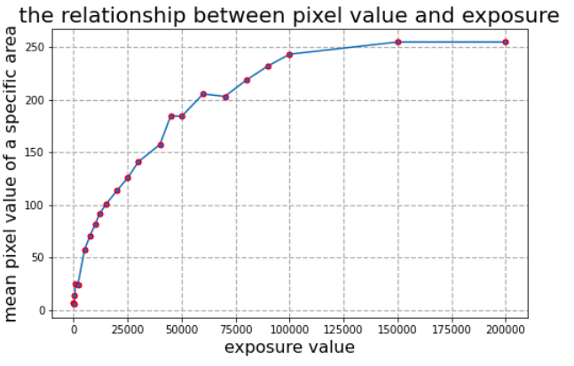
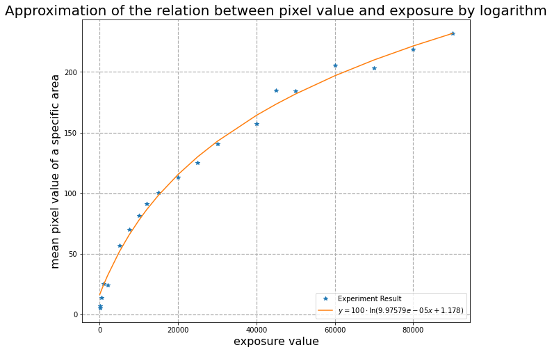
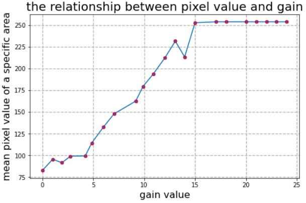
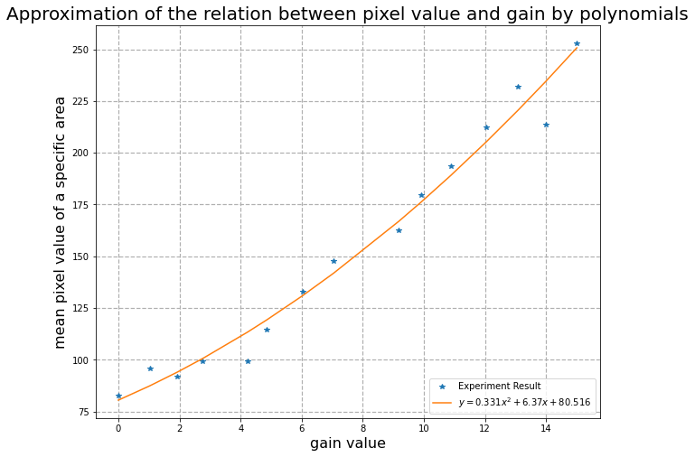
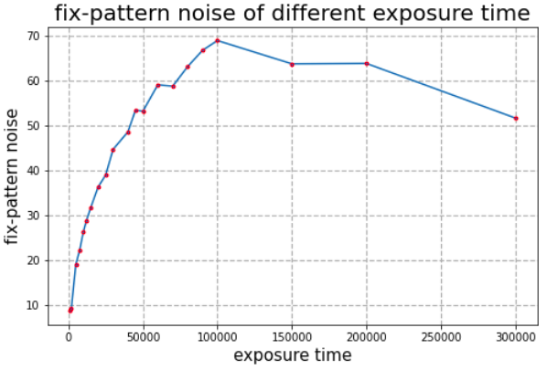
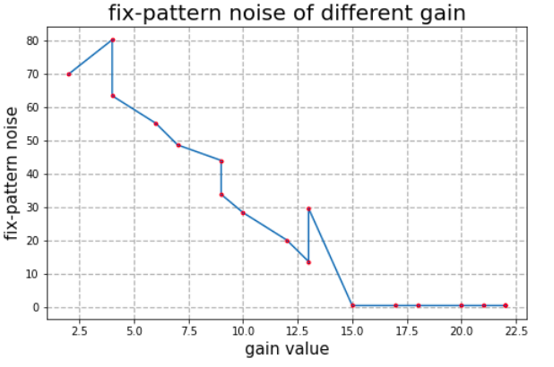

# Lab 1 for IAVI Course: Image processing

<center>
    Group Number：3 &nbsp; &nbsp; <br>Group Members：谢涛、林政楷、陈蔚
</center>


## 1 Introduction

This report is about the first lab of the course **Intelligent Acquisition of Visual Information** in fall, 2021.

As the first lab of the course, it aims at:

- Help students to acquire familiar with basis about the Basler camera.
- Complete the installation of Pylon SDK and OpenCV.
- Get  used to the programming tools.

Since out group have difficulty in using the programs to grab pictures, some of the picture below are captured by hand.


## 2 Environment and Equipment

### 2.1 Equipment

The type of camera we are using is **Dual Basler Dart Machine Vision USB3 Color Cameras**/

Some of the related parameters are listed below:

- $2592 \times 1944$ resolution;
- $14 \text{ fps}$ frame rate；
- $1.6$ aperture；
- $8mm$ focal length；

### 2.2 Environment

 We use`Python` as the programming tool in this lab：

- $3.7.10$ Version `Python`；
- $4.5.3$ Version `OpenCV`；
- $1.7.3$ Version `pypylon`；

Considering the lack of related documents for `pypylon`, we'll try using `C++` in following labs.


## 3 Process of Experiment

We try to finish the basic parts of the lab in the steps below：

1. Open the `Pylon View`  application, close the auto settings for the parameters，then try to grab some pictures；
2. keep the `gain`  fixed, set the  `exposure`  to vary from the minimal value to the maximum value, grab the pictures for further analysis；
3. keep the `exposure`  fixed,  set the `gain`  to vary from the minimal value to the maximum value，grab the pictures for further analysis；
4. We could try to find the differences using naked eyes；
5. Do quantitative analysis, use the value of some fixed pixels；

## 4 Result Analysis

### 4.1 Exposure Time

As for the parameter `exposure` , we have the following result:



As shown in the figure, the value of fixed pixels varies with  parameter `exposure time` in a $\ln$ curve.

We try to fit the functions, and get the result as follows.



### 4.2 Gain

As for the parameter `exposure` , we have the following result:



As shown in the figure, the value of fixed pixels varies with  parameter `gain` in a linear function before reaching the maximum value 255.

We try to fit the functions, and get the result as follows.




## 5 A Quantitative Noise Model(Bonus)

### 5.1 Data Access and Introduction

Modeling imaging noise is a significant task for many image processing and computer vision applications. There are already many researches done which tries to derive a state of art model for captured pixels, for example, the most simple but classic one is additive white Gaussian noise(a combination of both Poisson and Gaussian noise), and more realistic models like photon noise, read noise, fixed-pattern noise and dark current noise. And recently, Ke-Chi Chang[[1]](#refer-anchor-1) proposed a **learning-based generative model** which achieves better performance than existing statistical and other learning-based models, however, we cannot afford to apply these learning-based models since we only have an extremely limited dataset got last Friday in a hurry, so we choose to analysis the most widely used classification model based on the tense: **fixed-pattern noise** and **temporal noise**.

According to our experiments and the related researches, we think the related parameters are:

+ exposure time;
+ gain value;
+ ISO value;
+ ...

### 5.2 Supposed Noise Models

#### 5.2.1 Fixed-Pattern Noise

[**Fixed-pattern noise (FPN)** is the term given to a particular noise pattern on digital imaging sensors often noticeable during longer exposure shots where particular pixels are susceptible to giving brighter intensities above the general background noise.](https://en.wikipedia.org/wiki/Fixed-pattern_noise)

Fixed-pattern noise is independent of time which means the amplitude of noise will not change as the time goes. And the fixed-pattern noise has one special feature, namely the noise will show up in the same pattern or distribution under the same combination of capture parameters.

We can take say $n$ photos of the same pure black reference under the same circumstance and do an average operation to get an average signal photo, after we get the average signal photo stored in a matrix `images`, we can compute the total fixed-pattern noise, column-wise and row-wise noise by the following equations:

|    FPN type     |          Equation          |
| :-------------: | :------------------------: |
|    total FPN    |      $\sigma(images)$      |
| column-wise FPN | $\sigma(mean(images,\ 1))$ |
|  row-wise FPN   | $\sigma(mean(images,\ 2))$ |

According to the researches: the expected noise are positively correlated with the exposure time but negatively correlated with the gain.

#### 5.2.2 Model Validation

Lets  take a look at the experiment photos we got, exposure time $\in [10, 800000]$:


According to our experiment data, we compute the fixed-pattern noise of different exposure time(fix gain) and different gain value(fix exposure time) and draw the two figures below:



+ we can see from the figure 1 above that under different exposure time(fix gain):
  + exposure $\in[0, 100000]$: fixed-pattern noise is approximately positively correlated with exposure;
  + exposure $\in [100000,\ \infty]$: fixed-pattern noise is about to decrease to $0$, which is because that when the exposure time is large, the photos we got is super bright indicating that all the pixels are roughly $[255,\ 255,\ 255]$ resulting zero variance;
+ we can see from the figure 2 above that under different gain(fix exposure):
  + fixed-pattern noise is approximately negatively correlated with gain;

We can see from the result above that the noise of our experiment photos follow the expected pattern.


## 6 Reflection and Experience

In this lab, we have successfully found the relationship between some of the camera parameters and the grabbed photo. It not only deepens our understanding towards the cameras but also get us familiar with some programming tools.

In this lab, we at first try to install `Pylon` and `OpenCV` in Windows, but fails for the incompatible versions between the tools. Therefore, instead of using `Visual Studio`, we try to install it in Ubuntu and succeed.


## Appendix: Source Code

`grab_pic.py`:

```python
# ===============================================
# This file is used to grab photos automatically
# ===============================================

from pypylon import pylon

img = pylon.PylonImage()
# Number of images to be grabbed.
countOfImagesToGrab = 10
# Create an instant camera object with the camera device found first.
camera = pylon.InstantCamera(pylon.TlFactory.GetInstance().CreateFirstDevice())
camera.Open()

# Set the value of Gain and Exposure Time.
camera.Gain = 5
camera.ExposureTime = 90000

# Print the model name of the camera.
print("Using device ", camera.GetDeviceInfo().GetModelName())

# demonstrate some feature access
new_width = camera.Width.GetValue() - camera.Width.GetInc()
if new_width >= camera.Width.GetMin():
    camera.Width.SetValue(new_width)

# The parameter MaxNumBuffer can be used to control the count of buffers
# allocated for grabbing. The default value of this parameter is 10.
camera.MaxNumBuffer = 10

# Start the grabbing of c_countOfImagesToGrab images.
# The camera device is parameterized with a default configuration which
# sets up free-running continuous acquisition.
camera.StartGrabbingMax(countOfImagesToGrab)

i = 0
# Camera.StopGrabbing() is called automatically by the RetrieveResult() method
# when c_countOfImagesToGrab images have been retrieved.

while camera.IsGrabbing():
    # Wait for an image and then retrieve it. A timeout of 5000 ms is used.
    grabResult = camera.RetrieveResult(10000000, pylon.TimeoutHandling_ThrowException)

    img.AttachGrabResultBuffer(grabResult)
    filename = "saved_pypylon_G5_E9_img_%d.png" % i
    img.Save(pylon.ImageFileFormat_Png, filename)
    
    i += 1

    # In order to make it possible to reuse the grab result for grabbing
    # again, we have to release the image (effectively emptying the
    # image object).
    img.Release()

    # Image grabbed successfully?
    if grabResult.GrabSucceeded():
        # Access the image data.
        print("SizeX: ", grabResult.Width)
        print("SizeY: ", grabResult.Height)
        imgShow = grabResult.Array
        print("Gray value of first pixel: ", imgShow[0, 0])
    else:
        print("Error: ", grabResult.ErrorCode, grabResult.ErrorDescription)
    grabResult.Release()

camera.Close()
```

`process.py`:

```python
# ===============================================
# This file is used to do data analysis
# ===============================================

import os
import re
import cv2
import numpy as np
import matplotlib.pyplot as plt

# Step 1:
# Analyse the influence of exposure time
path = './imgs_E'
x, y = [], []

# Get the pictures
for filename in os.listdir(path):
    file = os.path.join(path, filename)
    x.append(int(filename.split('_')[0][1:]))               # exposure parameter exploration
    img = cv2.imread(file)
    y.append(np.mean(img[483-5:483+5, 1777-5:1777+5, 2]))   # mean pixel value
    
# Sort the data and show them in a figure.
x, y = zip(*sorted(zip(x, y)))
plt.figure(figsize=(8, 5))
plt.plot(x[:23], y[:23], marker='o', markersize='5', markeredgecolor='red')
plt.title('the relationship between pixel value and exposure', fontsize=20)
plt.ylabel('mean pixel value of a specific area', fontsize=16)
plt.xlabel('exposure value', fontsize=16)
plt.grid(ls='--', linewidth=1.2)
plt.show()

E = x[:20]
P = y[:20]

# Hyperparameters
shift_P = 0
shrink_P = 100

# Try to fit the result into a curve.
coeff = np.polyfit(E, np.exp(np.divide(np.add(P, shift_P), shrink_P)), 1)
def approx_log(x, coeff):
    return shrink_P * np.log(coeff[0] * x + coeff[1]) + shift_P

lnval = list( approx_log(e, coeff) for e in E )

plt.figure(figsize=(10, 8))
plt.plot(E, P, '*')
plt.plot(E, lnval)
plt.title('Approximation of the relation between pixel value and exposure by logarithm', fontsize=20)
plt.ylabel('mean pixel value of a specific area', fontsize=16)
plt.xlabel('exposure value', fontsize=16)
plt.grid(ls='--', linewidth=1.2)
plt.legend(['Experiment Result', '$y = ' + str(shrink_P) + '\cdot \ln(' + str(round(coeff[0], 10)) + 'x + '+ str(round(coeff[1], 3)) + ')' + (str(shift_P) if shift_P != 0 else '') + '$'], loc = 'lower right')
plt.show()

# ============================================

# Step 2:
# Analyse the influence of gain
path = 'imgs_G'
x = []
y = []

for filename in os.listdir(path):
    file = os.path.join(path, filename)
    lst = re.split(r'[G|_|.]', filename)
    x.append(float(lst[2] + '.' + lst[3]))
    img = cv2.imread(file)
    y.append(np.mean(img[483-5:483+5, 1777-5:1777+5, 1]))
    
# Sort the data and show them in a figure.
x, y = zip(*sorted(zip(x, y)))
plt.figure(figsize=(8, 5))
plt.plot(x[:23], y[:23], marker='o', markersize='5', markeredgecolor='red')
plt.title('the relationship between pixel value and gain', fontsize=20)
plt.ylabel('mean pixel value of a specific area', fontsize=16)
plt.xlabel('gain value', fontsize=16)
plt.grid(ls='--', linewidth=1.2)
plt.show()

# Try to fit the result into a curve.
G = x[:15]
P = y[:15]
coeff = np.polyfit(G, P, 2)
poly = np.poly1d(coeff)
pval = poly(G)

plt.figure(figsize=(10, 8))
plt.plot(G, P, '*')
plt.plot(G, pval)
plt.title('Approximation of the relation between pixel value and gain by polynomials', fontsize=20)
plt.ylabel('mean pixel value of a specific area', fontsize=16)
plt.xlabel('gain value', fontsize=16)
plt.grid(ls='--', linewidth=1.2)
plt.legend(['Experiment Result', '$y = ' + str(round(coeff[0], 3)) + 'x^2 + '+ str(round(coeff[1], 3)) + 'x + ' + str(round(coeff[2], 3)) + '$'], loc = 'lower right')
plt.show()
```

`process_bonus.py`:

```python
# ===============================================
# This file is used to do noise model analysis
# ===============================================

import os
import re
import cv2
import numpy as np
import matplotlib.pyplot as plt

# Step 1:
# Analyse the relationship between fixed-pattern noise and exposure time
path = './imgs_E'
expo, fixn = [], []
# compute the fixed-pattern noise of pictures of different exposure time
for filename in os.listdir(path):
    expo.append(int(filename.split('_')[0][1:]))
    imgs = cv2.imread(os.path.join(path, filename))
    img_gray = cv2.cvtColor(imgs, cv2.COLOR_RGB2GRAY)
    fixn.append(np.std(imgs[1400-10:1400+10, 1747-10:1747+10]))
# draw the result figure
x, y = zip(*sorted(zip(expo, fixn), key=lambda x: x[0]))
plt.figure(figsize=(8, 5))
plt.plot(x[3:24], y[3:24], marker='o', markersize=3, markeredgecolor='r')
plt.title('fix-pattern noise of different exposure time', fontsize=20)
plt.ylabel('fix-pattern noise', fontsize=15)
plt.xlabel('exposure time', fontsize=15)
plt.grid(ls='--', linewidth=1.2)
plt.show()

# =============================================================
# Step 2:
# Analyse the relationship between fixed-pattern noise and gain
path = './imgs_G'
gain, fixg = [], []
# compute the fixed-pattern noise of pictures of different gain
for filename in os.listdir(path):
    gain.append(int(filename.split('_')[1][1:]))
    imgs = cv2.imread(os.path.join(path, filename))
    img_gray = cv2.cvtColor(imgs, cv2.COLOR_RGB2GRAY)
    fixg.append(np.std(imgs[1400-10:1400+10, 1747-10:1747+10]))
# draw the result figure
x, y = zip(*sorted(zip(gain, fixg), key=lambda x: x[0]))
plt.figure(figsize=(8, 5))
plt.plot(x[3:21], y[3:21], marker='o', markersize=3, markeredgecolor='r')
plt.title('fix-pattern noise of different gain', fontsize=20)
plt.ylabel('fix-pattern noise', fontsize=15)
plt.xlabel('gain value', fontsize=15)
plt.grid(ls='--', linewidth=1.2)
plt.show()
```


<div id="refer-anchor-1"></div>
[1] Ke-Chi Chang, Ren Wang, Hung-Jin Lin, Yu-Lun Liu, Chia-Ping Chen, Yu-Lin Chang, Hwann-Tzong Chen: “Learning Camera-Aware Noise Models”, 2020; [http://arxiv.org/abs/2008.09370 arXiv:2008.09370].

