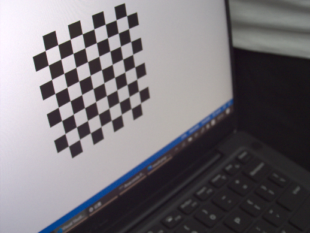
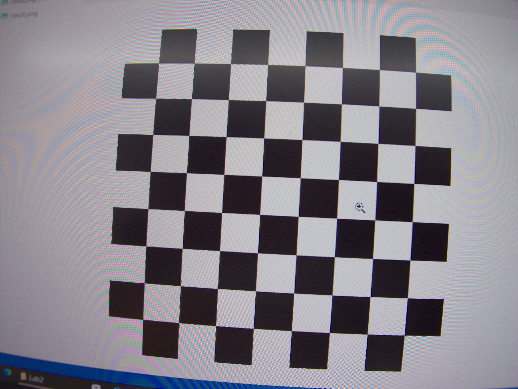

# <center>Lab 2 for IAVI: Camera Calibration

<center>
    Group Number：3 &nbsp; &nbsp; <br>Group Members：陈蔚、林政楷、谢涛
</center>
## 0 Menu

[toc]

## 1 Introduction

This report is about the second lab of the course **Intelligent Acquisition of Visual Information** in fall, 2021. 

As the second lab of the course, this lab aims to:

1. Finish the intrinsic and extrinsic calibration;
2. Discuss the impact of different factors(`e.g.`, number of images, coverage of the chessboard, view angle...)over the final re-projection error;
3. Output the estimated camera centers and the chessboard into `a.ply` file for 3D viewing in software like MeshLab;
4. Project some interesting 3D points on the input images (`e.g.`, augmented reality);
5. Make a real-time demo, as a bonus point;


## 2 Environment

1. Pylon Viewer for GUI;
2. Python with `opencv2` and pylon sdk to acquire data;
3. `matplotlib` to visualization, `numpy` to do calculation;
4. `c++` environment;
5. The type of camera we are using is **Dual Basler Dart Machine Vision USB-3 Color Cameras**.


## 3 Process of Experiment

### 3.1 Intrinsic and Extrinsic Calibration

After we get our processing images, we can use the camera calibration sample program in the directory `./opencv/samples/cpp/tutorial_code/calib3d/camera_calibration/` to calibrate the camera and get its intrinsic and extrinsic calibration.

The source code and `MakeFile` are provided in the appendix, here we show the calibrated images below:


and here are more different calibrated result under different circumstances:

#### 3.1.1 center calibration


the intrinsic parameter of the camera is:
$$
\text{camera matrix}=\begin{bmatrix}
    799.090454413611 &0. &258.500000000000\\
    0. &799.090454413611 &194.\\
    0. &0. &1.
\end{bmatrix}
$$

$$
\text{dist\_coef}=[-5.1370337298090252\times10^{-1},\ -3.8587812320837975,\ 0,\ 0,\ 3.2201686973865336\times10^{1}]
$$

$$
\text{avg reprojection error} = 0.390145
$$

#### 3.1.2 different angles


the intrinsic parameter of the camera is:
$$
\text{camera matrix}=\begin{bmatrix}
    743.242897231928 &0. &258.500000000000\\
    0. &743.242897231928 &194.\\
    0. &0. &1.
\end{bmatrix}
$$

$$
\text{dist\_coef}=[-6.0110196886835043\times10^{-1},\ 8.9992417288333604\times10^{-1},\ 0,\ 0,\ -3.0866994164935195]
$$

$$
\text{avg reprojection error} = 0.39635
$$

#### 3.1.3 half circle


the intrinsic parameter of the camera is:
$$
\text{camera matrix}=\begin{bmatrix}
    635.900655412143 &0. &297.\\
    0. &635.900655412143 &396.500000000000\\
    0. &0. &1.
\end{bmatrix}
$$

$$
\text{dist\_coef}=[-1.1094734593132325\times10^{-2},\ 3.5965489305511100\times10^{-1},\ 0,\ 0,\ -9.1368207517342626\times10^{-1}]
$$

$$
\text{avg reprojection error} = 0.347829
$$


### 3.2 Analysis Different Factors

#### 3.2.1 Number of Images

We took a total number of 50 images from the same angle and same coverage, and we input different number of images to the calibration program, and then we get the figure below “relationship between re-projection error and number of images”:


we used $[2, 3, 5, 8, 10, 15,20,25, 30, 35, 40, 45, 50]$ images to calibration program respectively, and we can see from the figure above that:

+ in the case of a small number of images, the error will have a large fluctuation;
+ but as the number of images increases, the re-projection error tends to be stable, say $0.55$;

#### 3.2.2 View of Angle

We took a number of images from different angle, say from left view to right view, for each view we list one of them below:



for each view of angle, we took 5 images, and we input them into the calibration program respectively, and we got the figure below:


+ a straight or small view of angle tend to corresponds to a smaller error;
+ and the error tends to become larger when the angle becomes extreme;

#### 3.2.3 Coverage of the Chessboard

We took a number of images of different coverage of the chessboard, for each coverage we list one of them below:



for each coverage of chessboard, we took 5 images, and we input them into the calibration program respectively, and we got the figure below:


+ for coverage 1 and coverage 2, since the chessboard is too small, the calibration program cannot figure out, so there is no output only running error;
+ and for coverage 3, 4, 5, the re-projection error does not have a obvious law, we when we look at the images again, it seems that the re-projection error will be smaller if the image itself has less distortion;

#### 3.2.4 Coverage of the Chessboard(Different Comprehensive)

Here we tried different coverage of the chessboard to measure the influence of that towards the calibration process:


As result, we found out that even a slightly coverage on the chessboard will cause the failure of calibration procedure.


### 3.3 Output Estimated Camera Center

The relationship between the camera coordinates and the unified world coordinate system is:
$$
\left[ \begin{matrix} x_c \\ y_c \\ z_c \end{matrix} \right] = \bold{R} \left[ \begin{matrix} x_w \\ y_w \\ z_w \end{matrix} \right] + \bold{t} \tag{1}
$$
Let $x_c  = 0, y_c = 0, z_c = 0$, then we could derive the formula to compute the coordinate for the cameras.
$$
\left[ \begin{matrix} x_{cam} \\ y_{cam} \\ z_{cam} \end{matrix} \right] = - \bold{R}^{-1} \bold{t}\tag{2}
$$
where $\bold{R}$ could be computed using Rodriguez formula from the rotation vectors.

Using the formula above, we could get the 3D points which could be seen in the application like MeshLab.


As you can see, those black dots which locate on a grid in the 3-D coordinate system are sample points on the chessboard used in calibration. And around that are the positions of camera while shooting, which form a semicircle as we have tried different angles when taking those shots.   


### 3.4 Project 3D Points

In order to project some fake 3D points on the resulting pictures, let's go through some mathematical background knowledge underlying the shooting frame.

Let us denote the position of a point in camera coordinate as $[x_c, y_c, z_c]$, and the pixel it maps to the picture as $[P_x, P_y]$ . Then the relationship between them can be expressed in:
$$
s\left[\begin{matrix}P_x \\ P_y \\ 1 \end{matrix}\right] = \begin{bmatrix}f_x, &0, &c_x \\0, &f_y, &c_y \\0 , &0, &1\end{bmatrix} \begin{bmatrix}x_c\\ y_c\\z_c\end{bmatrix} \tag{3}
$$
The matrix on the right-hand side is called the intrinsic matrix that have been calculated in Section 3.1. And combining it with equation $(1)$, we can project any arbitrary points in 3D world to the picture as a simple example of augmented reality. And here is our result:


 


### 3.5 Bonus: Make a Real-Time Demo

Now since we can project imaginary points into a stationary picture, our next step is to make it into a real-time program. Because the intrinsic parameters of the given camera are constants,  the only difficulty is to calculate the extrinsic parameters as we moving the camera. Thanks to `opencv-python` and `pypylon`, all of that can be done within a `python` program without using the `xml` file to store the intermediate information. Here is a [demo](./bonus.mp4) shot by our group.


## 4 Thoughts

In this experiment, we used the codes provided by `OpenCV` to implement the process of camera calibration. Then we derived the result from this process to get the intrinsic and extrinsic parameters of the camera we used. By exploiting those parameters, we figured out how the transformation from real-world 3D points to a 2D pixel on our picture works. And as a pretty cool application, we implemented augmented reality in a simple but quite interesting way. Throughout this process, we found out the principle of the process of camera calibration that we used everyday but hardly realized its existence. Also, it helped us reveal the basic mathematical background knowledge for augmented reality, which gave us a plenty of interesting ideas and inspiration in completing our final project.


## 5 Files in this Project

Detailed information about the files are listed in the `README.md` file in each directory.

```
.
├── camera_calibration
│   ├── bonus
│   │   └── demo.ipynb
│   ├── calibrate.py
│   ├── calibration_py.ipynb
│   ├── camera_calibration_show_extrinsics.py
│   ├── cpp
│   │   ├── build
│   │   │   ├── CMakeCache.txt
│   │   │   ├── CMakeFiles
│   │   │   ├── cmake_install.cmake
│   │   │   └── Makefile
│   │   ├── cailbration
│   │   ├── camera_calibration.cpp
│   │   ├── CMakeLists.txt
│   │   ├── in_VID5.xml
│   │   ├── out_camera_data.xml
│   │   ├── out_camera_data.yml
│   │   └── VID5.xml
│   ├── images
│   │   ├── calibrated
│   │   ├── original
│   │   ├── projected
│   │   └── scaled
│   ├── new.ply
│   ├── process.ipynb
│   └── README.md
├── chess_board_generate
│   ├── black.png
│   ├── create_pic.ipynb
│   ├── result.png
│   └── white.png
├── README.md
└── report
    ├── bonus.mp4
    ├── data_analysis.md
    ├── lab2_report.md
    ├── lab2_report.pdf
    ├── process.ipynb
    ├── ReadMe.md
    └── src
```

## 6 Appendix

Here are the codes that we use in this assignment:

```python
#---------------------------------------------#
#     python code process mission 1 and 2     #
#---------------------------------------------#
import os
import cv2
import numpy as np
from matplotlib import colors
import matplotlib.pyplot as plt

#-------------------------------------------------------------------
# draw the original images and calibrated images of number parameter
old_path = '../camera_calibration/images/scaled/number'
new_path = '../camera_calibration/images/calibrated/number'
images = ['8', '12', '25', '28']
for i in range(len(images)):
    old_img = os.path.join(old_path, images[i] + '.png')
    new_img = os.path.join(new_path, images[i] + '.png')
    old_img = plt.imread(old_img)
    new_img = plt.imread(new_img)
    plt.figure(i, figsize=(10, 8))
    plt.subplot(1, 2, 1)
    plt.title('center{}'.format(i+1) + ' original', fontsize=10)
    plt.imshow(old_img)
    plt.axis('off')
    plt.subplot(1, 2, 2)
    plt.title('center{}'.format(i+1) + ' calibrated', fontsize=10)
    plt.imshow(new_img)
    plt.axis('off')

#--------------------------------------------------------------------------
# draw the original images and calibrated images of different view of angle
old_path = '../camera_calibration/images/scaled/angle'
new_path = '../camera_calibration/images/calibrated/angle'
angles = ['angle1', 'angle2', 'angle3', 'angle4', 'angle5']
images = ['1', '2']
for i in range(len(angles)):
    old_path = '../camera_calibration/images/scaled/angle'
    new_path = '../camera_calibration/images/calibrated/angle'
    old_path = os.path.join(old_path, angles[i])
    new_path = os.path.join(new_path, angles[i])
    for j in range(len(images)):
        old_img = os.path.join(old_path, images[j] + '.png')
        new_img = os.path.join(new_path, images[j] + '.png')
        old_img = plt.imread(old_img)
        new_img = plt.imread(new_img)
        plt.figure(i*10+j, figsize=(10, 8))
        plt.subplot(1, 2, 1)
        plt.title('angle{}'.format(i+1) + ' original' + str(j+1), fontsize=10)
        plt.imshow(old_img)
        plt.axis('off')
        plt.subplot(1, 2, 2)
        plt.title('center{}'.format(i+1) + ' calibrated' + str(j+1), fontsize=10)
        plt.imshow(new_img)
        plt.axis('off')

#-----------------------------------------------------------------
# draw the original images and calibrated images of a semi-circle
old_path = '../camera_calibration/images/scaled/circle'
new_path = '../camera_calibration/images/calibrated/circle'
images = ['1', '2', '3', '4', '5', '6', '7', '8']
for i in range(len(images)):
    old_img = os.path.join(old_path, images[i] + '.jpg')
    new_img = os.path.join(new_path, images[i] + '.png')
    old_img = plt.imread(old_img)
    new_img = plt.imread(new_img)
    plt.figure(i, figsize=(10, 8))
    plt.subplot(1, 2, 1)
    plt.title('angle{}'.format(i+1) + ' original', fontsize=10)
    plt.imshow(old_img)
    plt.axis('off')
    plt.subplot(1, 2, 2)
    plt.title('angle{}'.format(i+1) + ' calibrated', fontsize=10)
    plt.imshow(new_img)
    plt.axis('off')

#-------------------------------------------------------------------------------
# draw the relationship between the number of images and the re-projection error
x = [2, 3, 5, 8, 10, 15, 20, 25, 30, 35, 40, 45, 50]
y = [0.221608, 0.221066, 1.31451, 1.16884, 0.381362, 0.359905, 0.358377, 0.489582, 0.537122, 0.553695, 0.542564, 0.537212, 0.532618]
plt.figure(figsize=(8, 5))
plt.title('relationship between the re-projection error and number of images', fontsize=20)
plt.ylabel('re-projection error', fontsize=16)
plt.xlabel('number of images', fontsize=16)
plt.plot(x, y, marker='o', markersize=5, markeredgecolor='r')
plt.grid(ls='--', linewidth=1.2)
plt.show()

#----------------------------------------------------------------------------
# draw the relationship between the view of angle and the re-projection error
from matplotlib import colors
x = [1, 2, 3, 4, 5]
y = [1.11275, 0.195122, 0.286406, 0.113764, 1.17832]
plt.figure(figsize=(9, 5))
plt.title('re-projection error and view angle', fontsize=20)
plt.xlabel('view of angle(from left to right)', fontsize=16)
plt.ylabel('re-projection error', fontsize=16)
plt.scatter(x[0], y[0], alpha=0.5, s=52.11, label='angel1')
plt.scatter(x[1], y[1], alpha=0.5, s=63.33, label='angel2')
plt.scatter(x[2], y[2], alpha=0.5, s=194.5, label='angel3')
plt.scatter(x[3], y[3], alpha=0.5, s=145.7, label='angel4')
plt.scatter(x[4], y[4], alpha=0.5, s=256.9, label='angel5')
plt.grid(ls='--', linewidth=1.2)
plt.colorbar()
plt.legend()
plt.show()

#-------------------------------------------------------------------------------------
# draw the relationship between the coverage of chessboard and the re-projection error
x = [3, 4, 5]
y = [0.1335526, 0.452167, 0.214804]
plt.figure(figsize=(8, 5))
plt.xlim((0.5, 5.5))
plt.xticks([1, 2, 3, 4, 5])
plt.title('re-projection error and coverage', fontsize=20)
plt.ylabel('re-projection error', fontsize=16)
plt.xlabel('coverage(from small to large)', fontsize=16)
plt.plot(x, y, marker='o', markersize=5, markeredgecolor='r')
plt.grid(ls='--', linewidth=1.2)
plt.show()
```

`camera_calibration/calibration_py.ipynb`:

```python
#---------------------------------------------#
#     python code process mission 3 and 4     #
#---------------------------------------------#

import cv2
import numpy as np
import glob

# 设置寻找亚像素角点的参数，采用的停止准则是最大循环次数30和最大误差容限0.001
criteria = (cv2.TERM_CRITERIA_MAX_ITER | cv2.TERM_CRITERIA_EPS, 30, 0.001)

# 获取标定板角点的位置
objp = np.zeros((8 * 8, 3), np.float32)
objp[:, :2] = np.mgrid[0:8, 0:8].T.reshape(-1, 2)  # 将世界坐标系建在标定板上，所有点的Z坐标全部为0，所以只需要赋值x和y

obj_points = []  # 存储3D点
img_points = []  # 存储2D点

# 获取对应文件夹下的所有图片，进行标定工作
images = glob.glob("images/scaled/circle/*.jpg")
# 需要对图片进行排序，不然之后的绘制过程可能会因为乱序而没有效果
images.sort()

# 遍历所有图片，寻找角点，并记录，等待后续标定使用
i=0
for fname in images:
    img = cv2.imread(fname)
    gray = cv2.cvtColor(img, cv2.COLOR_BGR2GRAY)
    size = gray.shape[::-1]
    ret, corners = cv2.findChessboardCorners(gray, (8, 8), None)
    
    if ret:

        obj_points.append(objp)

        corners2 = cv2.cornerSubPix(gray, corners, (5, 5), (-1, -1), criteria)  # 在原角点的基础上寻找亚像素角点
        if [corners2]:
            img_points.append(corners2)
        else:
            img_points.append(corners)

        cv2.drawChessboardCorners(img, (8, 8), corners, ret)  # 记住，OpenCV的绘制函数一般无返回值
        i+=1;
        cv2.imwrite('conimg'+str(i)+'.jpg', img)
        cv2.waitKey(1500)

# 显示可用图片的数量
print(len(img_points))
cv2.destroyAllWindows()

# 标定步骤
ret, mtx, dist, rvecs, tvecs = cv2.calibrateCamera(obj_points, img_points, size, None, None)

print("ret:", ret)
print("mtx:\n", mtx) # 内参数矩阵
print("dist:\n", dist)  # 畸变系数   distortion cofficients = (k_1,k_2,p_1,p_2,k_3)
print("rvecs:\n", rvecs)  # 旋转向量  # 外参数
print("tvecs:\n", tvecs ) # 平移向量  # 外参数

print("-----------------------------------------------------")

img = cv2.imread(images[2])
h, w = img.shape[:2]
newcameramtx, roi = cv2.getOptimalNewCameraMatrix(mtx,dist,(w,h),1,(w,h))#显示更大范围的图片（正常重映射之后会删掉一部分图像）
print (newcameramtx)

# 消除畸变，并显示效果
print("------------------使用undistort函数-------------------")
dst = cv2.undistort(img,mtx,dist,None,newcameramtx)
x,y,w,h = roi
dst1 = dst[y:y+h,x:x+w]
cv2.imwrite('calibresult3.jpg', dst1)
print ("方法一:dst的大小为:", dst1.shape)

# 重建得到相机的位置
result = []

for i in range(len(rvecs)):
    rot = cv2.Rodrigues(rvecs[i])
    R = rot[0]
    # 参见公式
    result.append(np.dot(np.linalg.inv(R), -tvecs[i]))
    
# 需要安装，pip install plyfile
# 创建ply文件
from plyfile import PlyData, PlyElement

def write_ply(save_path, points, pts, text=True):
    points = [(points[i, 0], points[i, 1], points[i, 2]) for i in range(points.shape[0])]

    for i in range(pts.shape[0]):
        points.append((pts[i, 0], pts[i, 1], pts[i, 2]))

    vertex = np.array(points, dtype=[('x', 'f4'), ('y', 'f4'), ('z', 'f4')])
    el = PlyElement.describe(vertex, 'vertex', comments=['vertices'])
    PlyData([el], text=text).write(save_path)

write_ply('new.ply', np.array(result), objp, True)

# 给定图片上的若干点，我们将其连接起来形成立方体的样子
def draw_lines(img, points):
    pairs = []
    pairs += [(i, i+4) for i in range(4)]
    pairs += [(i, (i+1)%4) for i in range(4)]
    pairs += [(i+4, (i+1)%4 + 4) for i in range(4)]
    for tup in pairs:
        pt1 = (int(points[tup[0], 0]), int(points[tup[0], 1]))
        pt2 = (int(points[tup[1], 0]), int(points[tup[1], 1]))
        cv2.line(img, pt1, pt2, (0, 0, 255), 4, 3)
        
# 图片数量
num_of_pic = 9

# origin中储存了立方体八个顶点在世界坐标系下的坐标
origin = [[2, 2,  0], [2, 3,  0], [3, 3,  0], [3, 2,  0],\
    [2, 2, -1], [2, 3, -1], [3, 3, -1], [3, 2, -1]]
origin = np.array(origin)
origin = np.hstack((origin, np.ones(8).reshape(8, 1)))

# 分别对每张图片进行重建
for i in range(num_of_pic):
    # 重建第一组点
    rot = cv2.Rodrigues(rvecs[i])
    R = rot[0]
    # [R T]，3 x 4
    mat = np.hstack((R, tvecs[i].reshape((3, 1))))
    
    # 利用公式算出世界坐标系下对应点在图像坐标系下的坐标
    tmp1 = np.dot(mat, origin.T)
    out = np.dot(mtx, tmp1)
    out = out / out[2, :]

    filename = './images/scaled/circle/' + str(i+1) + '.jpg'
    img = cv2.imread(filename)

    draw_lines(img, out.T)

    cv2.imwrite(str(i+1)+'.png', img)

```

`camera_calibration/bonus/demo.ipynb`:

```python
#---------------------------------------------#
#     python code process for the Bonus       #
#---------------------------------------------#

'''
利用pypylon以及opencv共同实现的一个实时Demo，
会在棋盘格的对应位置上绘制出小立方体，
具体效果请见文件夹中的演示视频
'''

from pypylon import pylon
import cv2
import cv2
import numpy as np
import glob

def draw_lines(img, points):
    pairs = []
    pairs += [(i, i+4) for i in range(4)]
    pairs += [(i, (i+1)%4) for i in range(4)]
    pairs += [(i+4, (i+1)%4 + 4) for i in range(4)]
    for tup in pairs:
        pt1 = (int(points[tup[0], 0]), int(points[tup[0], 1]))
        pt2 = (int(points[tup[1], 0]), int(points[tup[1], 1]))
        cv2.line(img, pt1, pt2, (0, 0, 255), 4, 3)

    cv2.imwrite('1.png', img)

# 设置寻找亚像素角点的参数，采用的停止准则是最大循环次数30和最大误差容限0.001
criteria = (cv2.TERM_CRITERIA_MAX_ITER | cv2.TERM_CRITERIA_EPS, 30, 0.001)

# 获取标定板角点的位置
objp = np.zeros((8 * 8, 3), np.float32)
objp[:, :2] = np.mgrid[0:8, 0:8].T.reshape(-1, 2)  # 将世界坐标系建在标定板上，所有点的Z坐标全部为0，所以只需要赋值x和y

# 连接到第一个可用的相机
camera = pylon.InstantCamera(pylon.TlFactory.GetInstance().CreateFirstDevice())

# 获取图像并定义了转换器
camera.StartGrabbing(pylon.GrabStrategy_LatestImageOnly) 
converter = pylon.ImageFormatConverter()

# 将抓取到的图像转换成为opencv支持的图像格式
converter.OutputPixelFormat = pylon.PixelType_BGR8packed
converter.OutputBitAlignment = pylon.OutputBitAlignment_MsbAligned

num = 1

while True:
    # 拍摄数量达到上限之后自动退出
    num += 1
    if num == 100:
        break

    cnt = 0
    obj_points = []  # 存储3D点
    img_points = []  # 存储2D点
    if num % 10 == 0:
        break
    while camera.IsGrabbing():
        grabResult = camera.RetrieveResult(5000, pylon.TimeoutHandling_ThrowException)

        i = 0

        if grabResult.GrabSucceeded():
            # Access the image data
            image = converter.Convert(grabResult)
            img = image.GetArray()
            img = cv2.resize(img, None, fx=0.4, fy=0.4)

            gray = cv2.cvtColor(img, cv2.COLOR_BGR2GRAY)
            size = gray.shape[::-1]
            ret, corners = cv2.findChessboardCorners(gray, (8, 8), None)

            if ret:

                obj_points.append(objp)

                corners2 = cv2.cornerSubPix(gray, corners, (5, 5), (-1, -1), criteria)  # 在原角点的基础上寻找亚像素角点
                if [corners2]:
                    img_points.append(corners2)
                else:
                    img_points.append(corners)

                cv2.drawChessboardCorners(img, (8, 8), corners, ret)  # 记住，OpenCV的绘制函数一般无返回值
                i+=1;
                cv2.imwrite('conimg'+str(i)+'.jpg', img)
                cv2.waitKey(1)

            cnt += 1

            if cnt % 2 == 0:
                break

        grabResult.Release()

    # 如果抓取到的图像中没有可以进行标定的棋盘格，则也退出
    if len(img_points) == 0:
        break

    # 标定
    ret, mtx, dist, rvecs, tvecs = cv2.calibrateCamera(obj_points, img_points, size, None, None)

    # 重建立方体顶点的坐标
    origin = [[2, 2,  0], [2, 3,  0], [3, 3,  0], [3, 2,  0], [2, 2, -1], [2, 3, -1], [3, 3, -1], [3, 2, -1]]
    origin = np.array(origin)
    origin = np.hstack((origin, np.ones(8).reshape(8, 1)))

    # 罗德里格斯变换得到旋转矩阵
    rot = cv2.Rodrigues(rvecs[0])
    R = rot[0]
    # [R T]，3 x 4
    mat = np.hstack((R, tvecs[0].reshape((3, 1))))
    
    tmp1 = np.dot(mat, origin.T)
    out = np.dot(mtx, tmp1)
    out = out / out[2, :]

    draw_lines(img, out.T)

    cv2.imshow(str(i+1)+'.png', img)
    k = cv2.waitKey(1)
    if k == 27:
        break
            
# 重新释放资源 
camera.StopGrabbing()
camera.Close()
cv2.destroyAllWindows()
```
