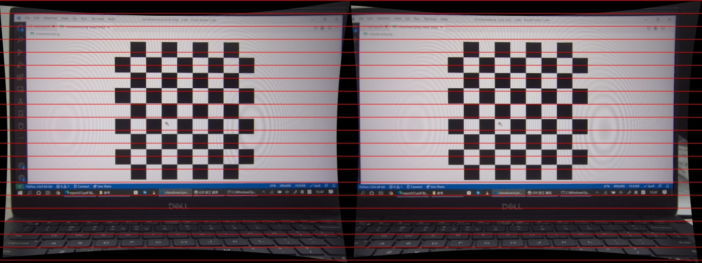

# 
Lab 3 for IAVI: Stereo Computation

## Contents

[toc]

## Introduction

This report is about the third lab of the course **Intelligent Acquisition of Visual Information** in fall, 2021;

In this lab, we would start from doing stereo calibration and finally achieve following aims:

1. Perform stereo calibration with OpenCV sample;
2. Compute a dense depth map/3D point cloud from two calibrated input views ;
3. Resolve the color discrepancy between two views and produce the final colored 3D point cloud, along with cameras in a single .ply file;

## Environment

Here is the environment we have used to complete the lab:

1. Pylon Viewer to capture images;
2. Python with `opencv2` to process the data;
3. The type of camera used  in the lab is **Dual Basler Dart Machine Vision USB-3 Color Cameras.**

## Process of Experiment

### Perform stereo calibration

#### Stereo calibration

Before doing stereo calibration, we need to do calibration for each camera respectively.

The `opencv2` package in python has provided a function `cv2.stereoCalibrate()` to do stereo calibration.

Specifically, it provides some `flags` to control the output result. We list some of the  most important flags below:

1. `cv2.CALIB_FIX_INTRINSIC`: fix the intrinsic parameters of the calibration result.
2. `cv2.CALIB_SAME_FOCAL_LENGTH`: force the focal length in the result to be same;

Since the focal length of the cameras we use could be viewed as the same approximately, we could turn on some of the flags above.

#### Stereo rectify

After doing stereo calibration, we need to do stereo rectification to reduce the computation cost and to improve performance.

Fortunately, `opencv2` has also provided function `cv2.stereoRectify()` to complete the job.

#### Result of calibration 

Once finishing the above steps, we would get the images that can be used in 3D reconstruction, we give one of the example below:

As shown in the figure, the two pictures have been aligned perfectly.

### Compute a depth map

### Study the influence of different parameters

### Resolve color discrepancy

## Thoughts

## Appendix: Source code

