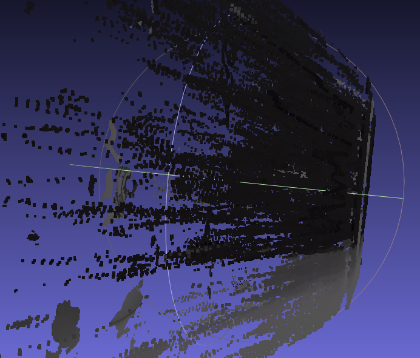
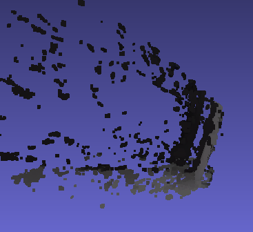
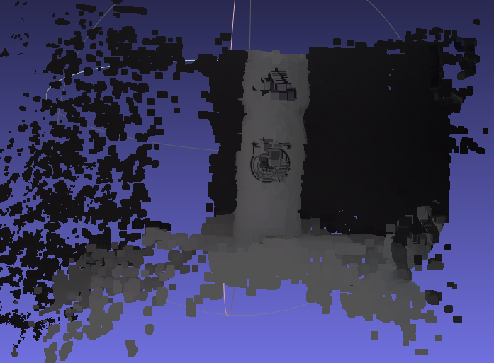
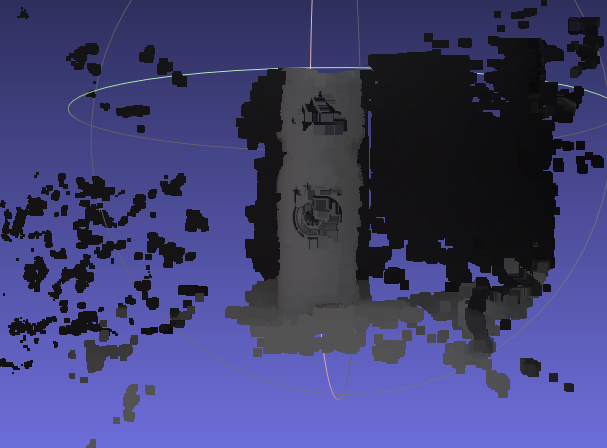

# <center>Lab 3 for IAVI: Stereo Computation

## Contents

[toc]

## 1 Introduction

This report is about the third lab of the course **Intelligent Acquisition of Visual Information** in fall, 2021;

In this lab, we would start from doing stereo calibration and finally achieve following aims:

1. Perform stereo calibration with OpenCV sample;
2. Compute a dense depth map/3D point cloud from two calibrated input views ;
3. Resolve the color discrepancy between two views and produce the final colored 3D point cloud, along with cameras in a single .ply file;


## 2 Environment

Here is the environment we have used to complete the lab:

1. Pylon Viewer to capture images;
2. Python with `opencv2` to process the data;
3. The type of camera used  in the lab is **Dual Basler Dart Machine Vision USB-3 Color Cameras.**


## 3 Process of Experiment

### 3.1 Perform stereo calibration

#### 3.1.1 Stereo calibration

Before doing stereo calibration, we need to do calibration for each camera respectively.

The `opencv2` package in python has provided a function `cv2.stereoCalibrate()` to do stereo calibration.

Specifically, it provides some `flags` to control the output result. We list some of the  most important flags below:

1. `cv2.CALIB_FIX_INTRINSIC`: fix the intrinsic parameters of the calibration result.
2. `cv2.CALIB_SAME_FOCAL_LENGTH`: force the focal length in the result to be same;

Since the focal length of the cameras we use could be viewed as the same approximately, we could turn on some of the flags above.

#### 3.1.2 Stereo rectify

After doing stereo calibration, we need to do stereo rectification to reduce the computation cost and to improve performance.

Fortunately, `opencv2` has also provided function `cv2.stereoRectify()` to complete the job.

#### 3.1.3 Result of calibration 

Once finishing the above steps, we would get the images that can be used in 3D reconstruction, we give one of the example below:


As shown in the figure, the two pictures have been aligned perfectly.

### 3.2 Compute a depth map

After we get the images that can be used in 3D reconstruction, we can 


### 3.3 Study the influence of different parameters

Since we have computed the depth map of the cup and recovered their corresponding 3D cloud points, we can now try to evaluate the impact of different parameters over final quality of the 3D object.

For the function `StereoSGBM_create(...)`, we try to evaluate the influence of each possible parameter, the results are as follows.

#### 3.3.1 `window_size`

| `ws` |                            result                            |
| :--: | :----------------------------------------------------------: |
|  1   |  |
|  3   |  |
|  5   |  |
|  10  |  |
|  15  |  |
|  20  |  |

+ we can see from the depth map that it seems that **the increment of the `window_size` will reduce the sensitivity to depth information**, because the shadow of the cup and of the crate differs the most significant when `window_size=1`;
+ but it seems that the **integrity of the recovered 3D cloud increased first and then decreased** as the `window_size` increases;

#### 3.3.2 `min_disp`

| `md` |                            result                            |
| :--: | :----------------------------------------------------------: |
|  4   |  |
|  8   |  |
|  16  |  |
|  32  |  |

+ we can see from the depth maps and 3D cloud points that the **`min_disp` almost has nothing to do with the sensitivity of depth**, it only change the minimum value of the disparity;

#### 3.3.3 `num_disp`

| `nd` |                            result                            |
| :--: | :----------------------------------------------------------: |
|  8   |  |
|  32  |  |
|  72  |  |
| 128  |  |
| 256  |  |

+ we can see from the depth map that it seems that **the increment of the `num_disp` will increase the sensitivity to depth information to some extend**:
  + when `num_disp < 72`, there is barely depth information got;
  + when `num_disp` continues to increase after 72, there is no more depth information to get, so their depth maps and 3D cloud points seem similar;
+ `num_disp` helps to distinguish between a pixel and its neighbors;

#### 3.3.4 `block_size`

| `bs` |                            result                            |
| :--: | :----------------------------------------------------------: |
|  4   |  |
|  8   |  |
|  16  |  |
|  32  |  |
|  64  |  |

+ we can see from the depth map that it seems that **the increment of the `blocksize` will decrease the sensitivity to depth information**, and this decrease is quite obvious

#### 3.3.5 `disp12MaxDiff`

| `dm` |                            result                            |
| :--: | :----------------------------------------------------------: |
|  12  |  |
|  32  |  |
|  64  |  |

+ we can see from the depth maps and 3D cloud points that the **`min_disp` almost has nothing to do with the sensitivity of depth**;

#### 3.3.6 `uniquenessRatio`

| `u`  |                            result                            |
| :--: | :----------------------------------------------------------: |
|  1   |  |
|  8   |  |
|  15  |  |
|  32  |  |
|  64  |  |

+ we can see from the depth map that it seems that **the increment of the `uniquenessRatio` will decrease the sensitivity to depth information**, both in the depth maps and in the 3D cloud points;

#### 3.3.7 `speckleWindowSize`

| `sw` |                            result                            |
| :--: | :----------------------------------------------------------: |
|  5   |  |
|  50  |  |
| 100  |  |

+ we can see from the depth maps and 3D cloud points that the **`min_disp` almost has nothing to do with the sensitivity of depth**;

#### 3.3.8 `speckleRange`

| `sr` |                            result                            |
| :--: | :----------------------------------------------------------: |
|  3   |  |
|  35  |  |
| 100  |  |

+ we can see from the depth maps and 3D cloud points that the **`min_disp` almost has nothing to do with the sensitivity of depth**;


### 3.4 Resolve color discrepancy

There are many different ways to resolve the color discrepancy between two views and paint the 3D point cloud we derived from the previous steps. For example, the basic method is to directly use the color information from the left view image or the right view. Though it's a quite simple method, the result matches the original images quite well:


<center style="color:#707070">Figure 1: 3D point cloud painted with color of left view</center>


<center style="color:#707070">Figure 2: 3D point cloud painted with color of right view</center>

In order to fully utilize the color information from two views, our group came up with an idea to combine and average the color of two pictures together. The underlying method is quite simple. Since two pictures capture the same scene and the only difference is the viewing angle, we can discard the information of position and only focus on the layout of colors. We can achieve that by doing an `SVD decomposition`, i.e, breaking down each channel to the form $A = U\Sigma V^T$. The matrix $\Sigma$ can be seen as the one contains most of the energy information of colors so that we can use the average of $\Sigma_{left}  $ and $\Sigma_{right}$ to recover the combination of colors from two views. The result is shown below:


<center style="color:#707070">Figure 3: 3D point cloud painted with color of right view</center>

## 4 Thoughts

In this experiment, we used the codes provided by `OpenCV` to implement the process of stereo camera calibration of two cameras to get the final focal length, and then we used the parameters we just got to serve as the input to the `stereo_match.py` to reconstruct the 3D object.

By exploiting many different parameters provided by `stereo_match.py`, we figured out how the transformation from a 2D pixel on our images to 3D cloud points works. And as a pretty cool application, we have implemented the reconstruction of a cup with a crate as background, which is quite heart-stirring, the result is great at least in our perspectives.

Throughout this process, we found out the principle of the process of camera calibration that we
used everyday but hardly realized its existence. Also, it helped us reveal the basic theory of 3D reconstruction, which is of great significance of our later project.


## Appendix: Source Code

```python
import cv2
import numpy as np
import glob

#############################################
# resize all images photoed by left camera  #
#############################################
images = glob.glob("../../../images/lab3/origin/left/*.png")
images.sort()
i = 0
for img_name in images:
    img = cv2.imread(img_name)
    img = cv2.resize(img, (int(img.shape[1]/4), int(img.shape[0]/4)))
    cv2.imwrite("../../../images/lab3/scaled/calibration/left/"+str(i + 1)+".jpg", img)
    i += 1
# resize all images photoed by right camera
images = glob.glob("../../../images/lab3/origin/right/*.png")
images.sort()
i = 0
for img_name in images:
    img = cv2.imread(img_name)
    img = cv2.resize(img, (int(img.shape[1]/4), int(img.shape[0]/4)))
    cv2.imwrite("../../../images/lab3/scaled/calibration/right/"+str(i + 1)+".jpg", img)
    i += 1

#########################################
#        perform stereo calibration     #
#########################################
# 设置寻找亚像素角点的参数，采用的停止准则是最大循环次数30和最大误差容限0.001
criteria = (cv2.TERM_CRITERIA_MAX_ITER | cv2.TERM_CRITERIA_EPS, 30, 0.001)
# 获取标定板角点的位置
objp = np.zeros((8 * 8, 3), np.float32)
objp[:, :2] = np.mgrid[0:8, 0:8].T.reshape(-1, 2)  # 将世界坐标系建在标定板上，所有点的Z坐标全部为0，所以只需要赋值x和y
obj_points = []         # 存储3D点
left_img_points = []    # 存储左图2D点
right_img_points = []   # 存储右图2D点
# 获取对应文件夹下的所有图片，进行标定工作
left_images = glob.glob("../../../images/lab3/scaled/calibration/left/*.jpg")
right_images = glob.glob("../../../images/lab3/scaled/calibration/right/*.jpg")
# 需要对图片进行排序，不然之后的绘制过程可能会因为乱序而没有效果
left_images.sort()
right_images.sort()
# 如果左相机拍的照片数量不等于右相机拍的照片的数量就报错
assert len(left_images) == len(right_images)
# 获取 2D 点坐标
images_pair = zip(left_images, right_images)
for l_img, r_img in images_pair:
    # finds the positions of internal corners of the chessboard of the left images
    left_img = cv2.imread(l_img)
    left_gray = cv2.cvtColor(left_img, cv2.COLOR_BGR2GRAY)
    l_size = left_gray.shape[::-1]
    left_ret, left_corners = cv2.findChessboardCorners(left_gray, (8, 8), None)
    # finds the positions of internal corners of the chessboard of the right images
    right_img = cv2.imread(r_img)
    right_gray = cv2.cvtColor(right_img, cv2.COLOR_BGR2GRAY)
    r_size = right_gray.shape[::-1]
    right_ret, right_corners = cv2.findChessboardCorners(right_gray, (8, 8), None)
    if left_ret and right_ret:
        # append the world coordinate of the standard chessboard
        obj_points.append(objp)
        # fines the corner locations of the left images' points
        left_corners2 = cv2.cornerSubPix(left_gray, left_corners, (5, 5), (-1, -1), criteria)
        left_img_points.append(left_corners2)
        # fines the corner locations of the right images' points
        right_corners2 = cv2.cornerSubPix(right_gray, right_corners, (5, 5), (-1, -1), criteria)
        right_img_points.append(right_corners2)
    else:
        print("couldn't find chessboard on " + l_img + " and " + r_img)
        break
# 获得左相机和右相机的相机矩阵
l_ret, l_mtx, l_dist, _, _ = cv2.calibrateCamera(obj_points, left_img_points, l_size, None, None)
r_ret, r_mtx, r_dist, _, _ = cv2.calibrateCamera(obj_points, right_img_points, r_size, None, None)
# 分别对图像做相机矫正
i = 0
pairs = zip(left_images, right_images)
for l_img, r_img in pairs:
    l_image = cv2.imread(l_img)
    h, w = l_image.shape[:2]
    # returns the new camera matrix of left camera based on the free scaling parameter
    newcameramtx, roi = cv2.getOptimalNewCameraMatrix(r_mtx, r_dist, (w, h), 1, (w, h))
    l_dst = cv2.undistort(l_image, r_mtx, r_dist, None, newcameramtx)
    cv2.imwrite("./images/lab3/scaled/calibration_result/left/"+str(i + 1)+".jpg", l_dst)
    r_image = cv2.imread(r_img)
    h, w = r_image.shape[:2]
    # returns the new camera matrix of right camera based on the free scaling parameter
    newcameramtx, roi = cv2.getOptimalNewCameraMatrix(r_mtx, r_dist, (w, h), 1, (w, h))
    r_dst = cv2.undistort(r_image, r_mtx, r_dist, None, newcameramtx)
    cv2.imwrite("./images/lab3/scaled/calibration_result/right/"+str(i + 1)+".jpg", r_dst)
    i = i + 1

##############################
#                            #
##############################

```

