# <center> Lab 4 for IAVI: Projector-Camera-Based Stereo Vision

<center>
    Group Number: 3 <br/>
    Group Members: 林政楷、谢涛、陈蔚
</center>

## Contents

[toc]


## 1 Introduction

This report is about the fourth lab of the course **Intelligent Acquisition of Visual Information** in fall. 2021.

This topic of this lab is to do projector-camera-based stereo vision and two possible ways are provided:

- Approach #1: 2 Cameras + 1 Projector;
- Approach #2: 1 Camera   + 1 Projector;

We've chosen the Approach #2 and finish the lab with the help of the paper and application got from website [http://mesh.brown.edu/calibration/].

To begin with, the most important steps of this lab includes:

1. Carefully calibrate the camera-projector system;
2. Project a pattern (the pattern we choose is `Gray Code`) and find correspondence between the pattern and the pixels;
3. Find the Depth map and 3D point cloud;

which would be discussed in details in the following sections.


## 2 Environment

The applications and packages used in this lab are:

- Pylon Viewer for GUI to capture images;
- `Python` with `opencv` to generate patterns;
- **Dual Basler Dart Machine Vision USB-3 Color Camera**;
- Application from [http://mesh.brown.edu/calibration/] to do calibration and reconstruct;


## 3 Experiment Principles

### 3.1 Camera calibration

The methods and steps to do camera calibration is same as what we do in the previous labs, we could use the `opencv` functions to find the corners of the chessboard and then do calibration.

### 3.2 Decoding

Decoding is the process of finding the correspondence between the image pixels and patterns, the main concepts of this step is to use the bright and dark pattern projected by the projector to encode the  positions.

For example, if a position in the image undergoes a sequence of *bright-dark-bright-bright-dark-bright*, the code of the position is $101101  = 45$.

### 3.3 Projector calibration

The mathematical model used to describe projector in this lab is actually the same as that of a camera. Thus, we could use the same method to calibrate the projector too.

The main difficulty to be solved is how to find the coordinates of the chessboard corners in the projector coordinate. Considering that there is a matrix to describe the transformation from the camera coordinate to the projector coordinate, so we could reduce it into an optimization problem as follows:
$$
\hat{H} = \arg \min_{H} \sum_{\forall p} || q - Hp ||^2,
$$
where $H \in \R^{3\times 3}$ is the transformation matrix,  $p = [x, y, 1]^T$ in the image coordinates, $q = [col, row, 1]^T$ in the view of projector.

### 3.4 Stereo calibration

Stereo calibration means finding the relative rotation and translation between projector and camera, which have been realized in the previous labs.

Similarly, we could use the `stereoCalibrate()` function from `opencv` to get the result.

### 3.5 Depth Measurement

After we calibrate the projector and camera, they can finally be used to implement the depth measuring for the given object. The mathematical principle underlying this procedure is surprisingly simple and elegant. Imagine there is a projector sitting next to the camera in front of the object we trying to capture, a series of specifically designed patterns (in this experiment, gray codes) will be projected to the target surface, while the pixels of the camera can capture those patterns from the view of camera. The whole scene can be expressed by the following graph:


Here, $O$ is a point that we want to calculate the depth $z$. The projector will shed a light on $O$ which will also intersect with the reference plane on $R$ at a depth of $z_0$. Now because of reflection, the light projected on point $O$ will be received by the pixel on $K_1$, while the imaginary point $R$ will be reflected to $R_1$. Using the knowledge of similar triangles, we can derived the equation to compute $z_0$:
$$
z = \frac{z_0}{1 + \frac{z_0}{f\cdot b}\cdot b}
$$
Here, $b$ is the distance between camera and projector, which is also called the baseline. 

Using this simple mathematical method, our group has also written our own program to perform a quite naive reconstruction of a given object.

[可以放一个我们最初重建的那个三角锥？]

The source code of this program can also be found on appendix.


## 4 Process of Experiment

### 4.1 Compute the Depth Map in Our Own Way

这里可以放一下蔚哥方法的思路和代码以及结果（就是那个pad壳）

### 4.2 Project Patterns and Calibrate Camera-Projector System

Since the results got via our own approach seems a little weird, so we resort to the software provided in [Projector-Camera Calibration / 3D Scanning Software (brown.edu)](http://mesh.brown.edu/calibration/software.html) as an elegant sulotion.

We wrote our own code to generate the desired gray coded projector images, the source code is in appendix and the images are shown below:

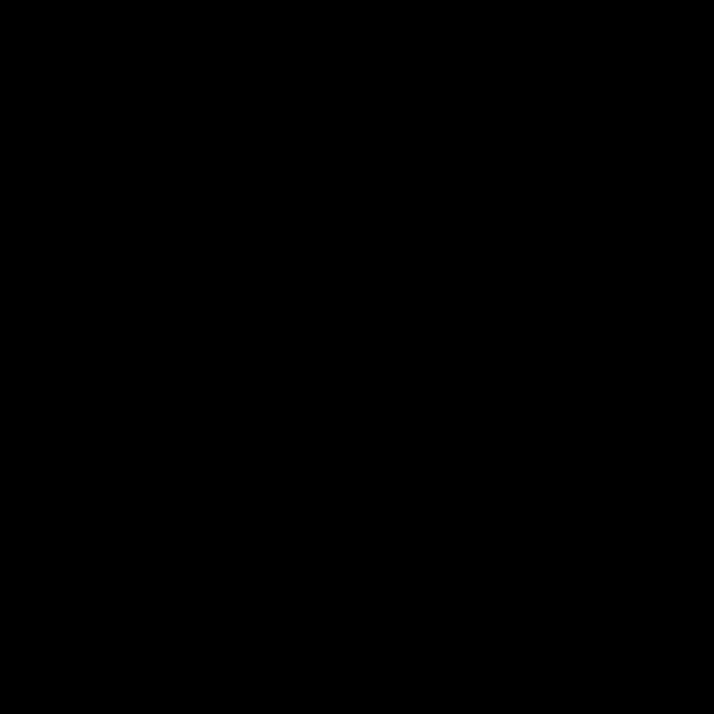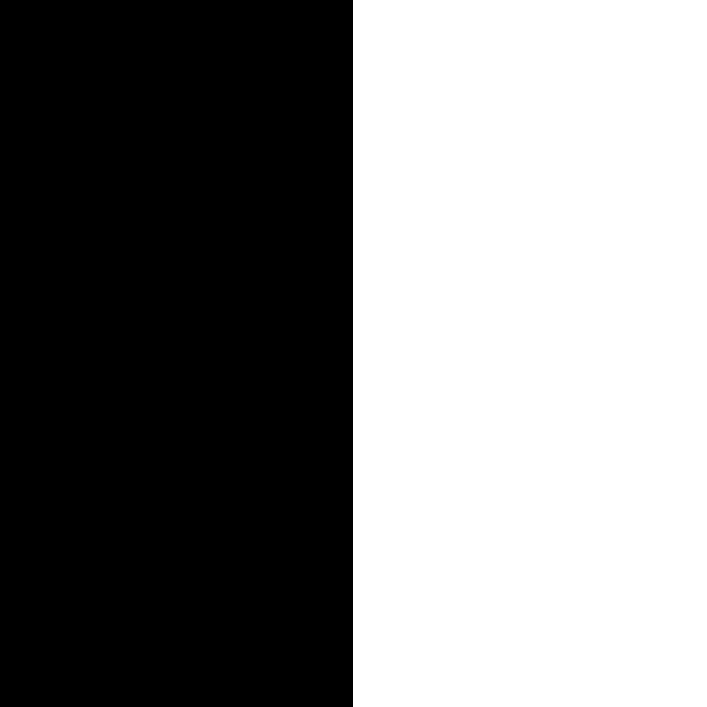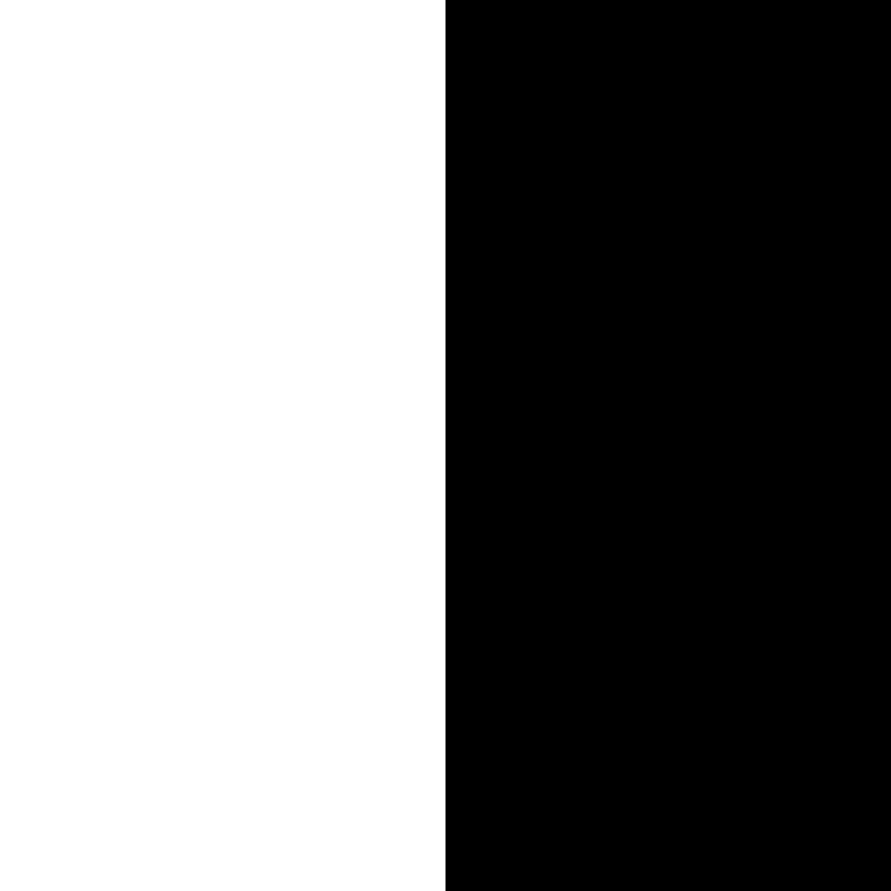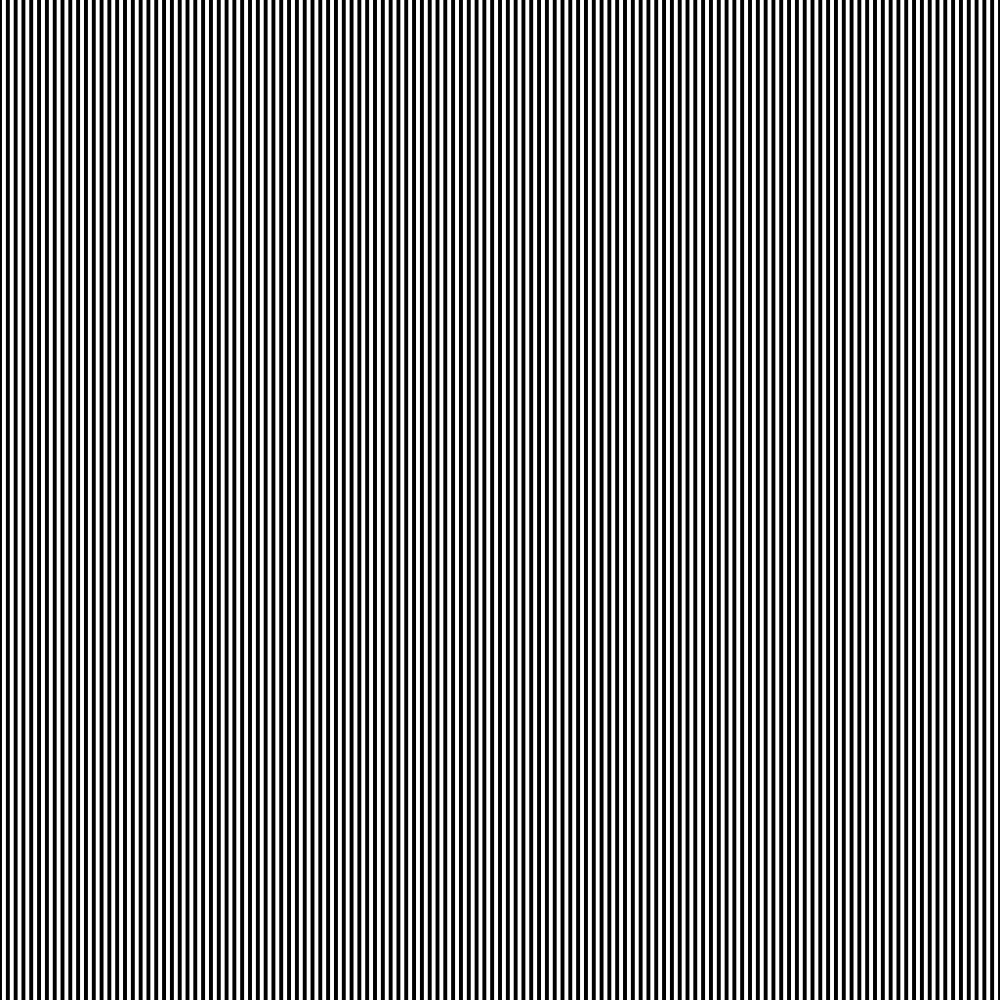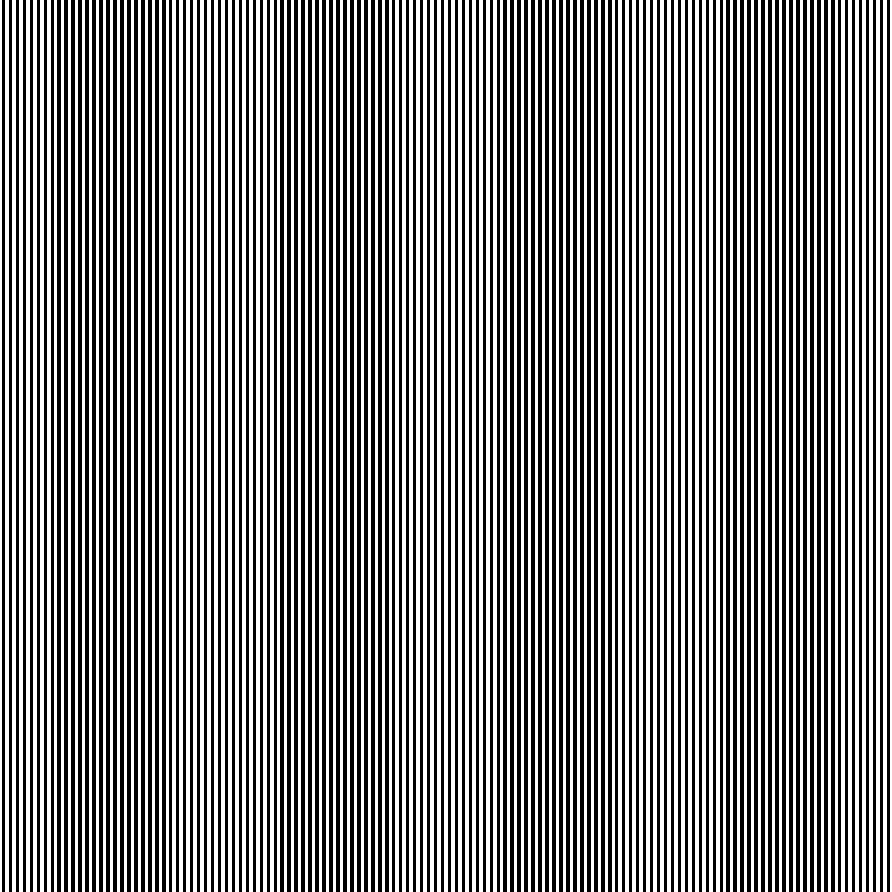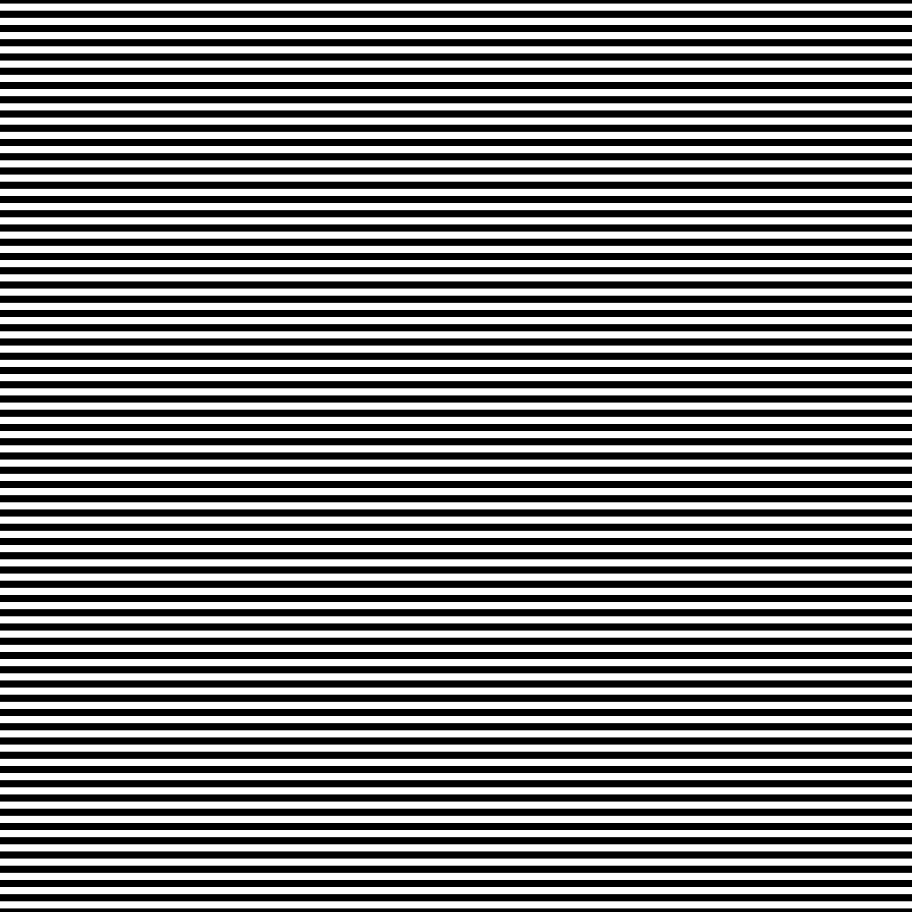

And then we project these gray coded images onto the chessboard, in order to correctly calibrate the camera-projector system, we took three group of image-projected chessboard images of different tilt angle, and we show one angle below:


And then, we can decode all of these images to find the correspondence between the image pixels and patterns, we shown part of the decoded images below:

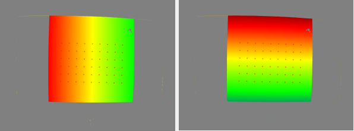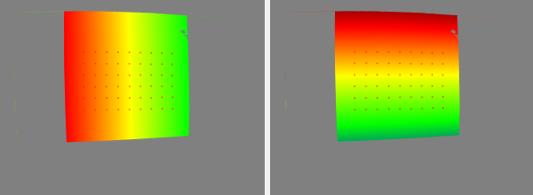

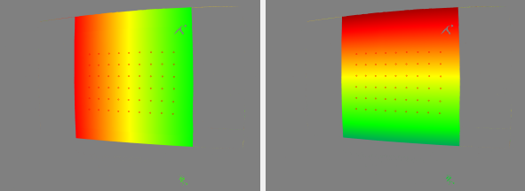

And then, we can perform stereo calibration to get the relationship between the camera and projector, which are fixed during all the time, the calibration result is as follows:

```yaml
Camera Calib: 
 - reprojection error: 1.60616
 - K:
[3506.75879408319, 0, 1238.159594621459;
  0, 3511.744456879962, 1004.261154710307;
  0, 0, 1]
 - kc: [-0.2931278642407246, -6.172067060389632, -0.000831729044154422, 0.004724794951695461, 0]

Projector Calib: 
 - reprojection error: 0.53308
 - K:
[8761.753050346029, 0, 468.8776360760827;
  0, 8826.310271488421, 413.5782143711002;
  0, 0, 1]
 - kc: [19.51836352675946, -20613.4956620585, -0.0003187728359299574, 0.07524481857198911, 0]

Stereo Calib: 
 - reprojection error: 10.4903
 - R:
[0.9831344844168168, -0.08997164655345816, 0.1592221352919853;
  0.01630429071693604, 0.9102701278756434, 0.4136936842658797;
  -0.1821558553950361, -0.4041205230048572, 0.8963848767307396]
 - T:
[-101.5556942442101;
  -251.1587705712684;
  3326.604783898938]
```

The result of the calibration is great, and we can see that the errors are relatively small.

#### 4.2.1 Problems we encountered

1. the most significant one is that, at first we **got black and white upside down**, which means the gray coded images we generated take $0$ for white and $1$ for black. And as a result, the decode process is completely destroyed, the original decoded images are shown as follow:

   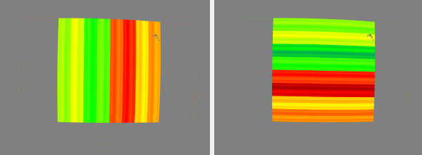

2. once the lab started, the relative position of the camera and projector must be fixed, we can only adjust the angle of the chessboard since we need to do stereo calibration, how stupid are we to move the camera to adjust the angle;

3. the brightness of the projected images may also exert some significant impact:

   + if we adjust the exposure time too large, then the pictured images are too bright for the program to extract all the corners;
   + if we adjust the exposure time too small, then the pictured images are too dark, which means it is hard to compare with two relative gray code project images, the decode process is ruined as a result;

### 4.3 Project Patterns on the Objects

#### 4.3.1 Project Patterns

After calibration of the camera-projector system, we use the whole system to project the same gray patterns to our own objects, here is the first one:


#### 4.3.2 Establish the Correspondences between Camera and Projector Pixels
We use the function to detect the pattern we project at chessboard, and the 3D points in the world coordinate system is computed as standard chessboard

And use the function to calibrate, and we can get the correspondences of all the pixels in the origin images and projector:

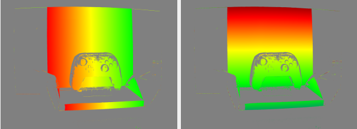

and the image in the projector's view is:

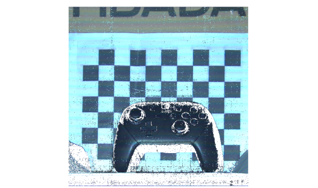

#### 4.3.3 Reconstruct

Using the code provided in the appendix to reconstruct the objects, the results are shown as follows:

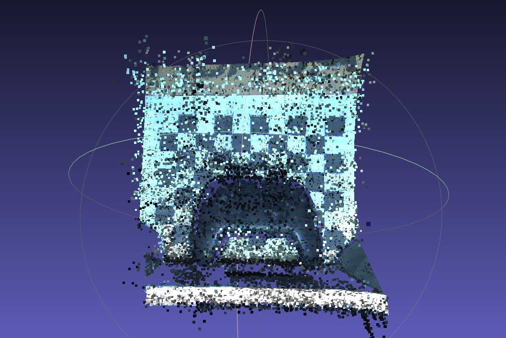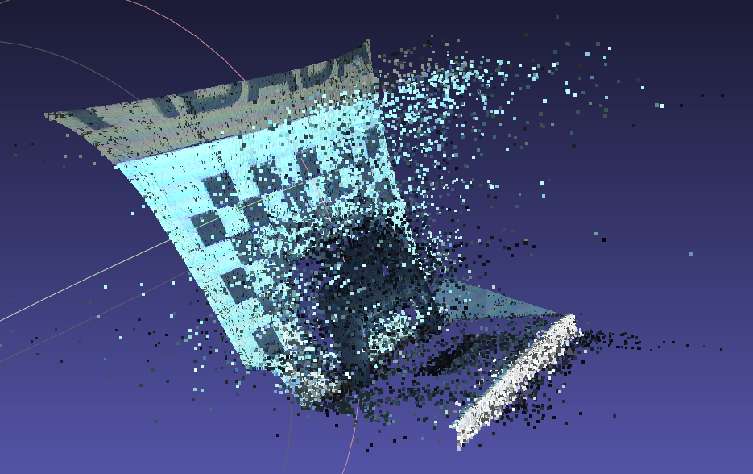


## 5 Thoughts

In this experiment, we complete the depth measurement using structured lighting with one camera and one projector. Though most parts of the whole procedure was based on the software posted on http://mesh.brown.edu/calibration/, we didn't give up the chance to expand and practice the knowledge of projector-camera-based stereo vision we learnt from class. By studying the paper written by Daniel Moreno and Gabriel Taubin along with the source code of the software, we have the basic idea of how to calibrate the projector as a camera, why this can benefit the depth measuring process and how the whole system works. In addition to implement this whole process on the given software by rote, our group also have tried to develop our own depth measurement system. Although the result gained from our work looks not as cool as the result produced by the standard software, we still find it quite interesting and meaningful in turning those theories into something really workable in practice. 


## Appendix: Source Code

```python
#############################################
#                 Our works                 #
#############################################

```

```cpp
/*
Copyright (c) 2014, Daniel Moreno and Gabriel Taubin
All rights reserved.

Redistribution and use in source and binary forms, with or without
modification, are permitted provided that the following conditions are met:
    * Redistributions of source code must retain the above copyright
      notice, this list of conditions and the following disclaimer.
    * Redistributions in binary form must reproduce the above copyright
      notice, this list of conditions and the following disclaimer in the
      documentation and/or other materials provided with the distribution.
    * Neither the name of the Brown University nor the
      names of its contributors may be used to endorse or promote products
      derived from this software without specific prior written permission.

THIS SOFTWARE IS PROVIDED BY THE COPYRIGHT HOLDERS AND CONTRIBUTORS "AS IS" AND
ANY EXPRESS OR IMPLIED WARRANTIES, INCLUDING, BUT NOT LIMITED TO, THE IMPLIED
WARRANTIES OF MERCHANTABILITY AND FITNESS FOR A PARTICULAR PURPOSE ARE
DISCLAIMED. IN NO EVENT SHALL DANIEL MORENO AND GABRIEL TAUBIN BE LIABLE FOR ANY
DIRECT, INDIRECT, INCIDENTAL, SPECIAL, EXEMPLARY, OR CONSEQUENTIAL DAMAGES
(INCLUDING, BUT NOT LIMITED TO, PROCUREMENT OF SUBSTITUTE GOODS OR SERVICES;
LOSS OF USE, DATA, OR PROFITS; OR BUSINESS INTERRUPTION) HOWEVER CAUSED AND
ON ANY THEORY OF LIABILITY, WHETHER IN CONTRACT, STRICT LIABILITY, OR TORT
(INCLUDING NEGLIGENCE OR OTHERWISE) ARISING IN ANY WAY OUT OF THE USE OF THIS
SOFTWARE, EVEN IF ADVISED OF THE POSSIBILITY OF SUCH DAMAGE.
*/
/*
#############################################
#      Camera and Projector Calibration     #
#############################################
*/

void Application::calibrate(void)
{   //try to calibrate the camera, projector, and stereo system

    unsigned count = static_cast<unsigned>(model.rowCount());
    const unsigned threshold = config.value("main/shadow_threshold", 0).toUInt();

    calib.clear();

    std::cout << " shadow_threshold = " << threshold << std::endl;

    cv::Size imageSize(0,0);

    //detect corners ////////////////////////////////////
    processing_message("Extracting corners:");
    if (!extract_chessboard_corners())
    {
        return;
    }
    processing_message("");

    //collect projector correspondences
    corners_projector.resize(count);
    pattern_list.resize(count);
    min_max_list.resize(count);

    processing_set_progress_total(count);
    processing_set_progress_value(0);
    processing_set_current_message("Decoding and computing homographies...");

    for (unsigned i=0; i<count; i++)
    {
        std::vector<cv::Point2f> const& cam_corners = corners_camera[i];
        std::vector<cv::Point2f> & proj_corners = corners_projector[i];

        QModelIndex index = model.index(i, 0);
        QString set_name = model.data(index, Qt::DisplayRole).toString();
        bool checked = (model.data(index, Qt::CheckStateRole).toInt()==Qt::Checked);
        if (!checked)
        {   //skip
            processing_message(QString(" * %1: skip (not selected)").arg(set_name));
            processing_set_progress_value(i+1);
            continue;
        }

        //checked: use this set
        proj_corners.clear(); //erase previous points

        processing_set_current_message(QString("Decoding... %1").arg(set_name));

        cv::Mat & pattern_image = pattern_list[i];
        cv::Mat & min_max_image = min_max_list[i];
        if (!decode_gray_set(i, pattern_image, min_max_image))
        {   //error
            std::cout << "ERROR: Decode image set " << i << " failed. " << std::endl;
            return;
        }

        if (imageSize.width==0)
        {
            imageSize = pattern_image.size();
        }
        else if (imageSize != pattern_image.size())
        {
            std::cout << "ERROR: pattern image of different size: set " << i << std::endl;
            return;
        }

        //cv::Mat out_pattern_image = sl::PIXEL_UNCERTAIN*cv::Mat::ones(pattern_image.size(), pattern_image.type());

        processing_set_current_message(QString("Computing homographies... %1").arg(set_name));

        for (std::vector<cv::Point2f>::const_iterator iter=cam_corners.cbegin(); iter!=cam_corners.cend(); iter++)
        {
            const cv::Point2f & p = *iter;
            cv::Point2f q;

            if (processing_canceled())
            {
                processing_set_current_message("Calibration canceled");
                processing_message("Calibration canceled");
                return;
            }
            processEvents();

            //find an homography around p
            unsigned WINDOW_SIZE = config.value(HOMOGRAPHY_WINDOW_CONFIG, HOMOGRAPHY_WINDOW_DEFAULT).toUInt()/2;
            std::vector<cv::Point2f> img_points, proj_points;
            if (p.x>WINDOW_SIZE && p.y>WINDOW_SIZE && p.x+WINDOW_SIZE<pattern_image.cols && p.y+WINDOW_SIZE<pattern_image.rows)
            {
                for (unsigned h=p.y-WINDOW_SIZE; h<p.y+WINDOW_SIZE; h++)
                {
                    register const cv::Vec2f * row = pattern_image.ptr<cv::Vec2f>(h);
                    register const cv::Vec2b * min_max_row = min_max_image.ptr<cv::Vec2b>(h);
                    //cv::Vec2f * out_row = out_pattern_image.ptr<cv::Vec2f>(h);
                    for (unsigned w=p.x-WINDOW_SIZE; w<p.x+WINDOW_SIZE; w++)
                    {
                        const cv::Vec2f & pattern = row[w];
                        const cv::Vec2b & min_max = min_max_row[w];
                        //cv::Vec2f & out_pattern = out_row[w];
                        if (sl::INVALID(pattern))
                        {
                            continue;
                        }
                        if ((min_max[1]-min_max[0])<static_cast<int>(threshold))
                        {   //apply threshold and skip
                            continue;
                        }

                        img_points.push_back(cv::Point2f(w, h));
                        proj_points.push_back(cv::Point2f(pattern));

                        //out_pattern = pattern;
                    }
                }
                cv::Mat H = cv::findHomography(img_points, proj_points, CV_RANSAC);
                //std::cout << " H:\n" << H << std::endl;
                cv::Point3d Q = cv::Point3d(cv::Mat(H*cv::Mat(cv::Point3d(p.x, p.y, 1.0))));
                q = cv::Point2f(Q.x/Q.z, Q.y/Q.z);
            }
            else
            {
                return;
            }

            //save
            proj_corners.push_back(q);
        }

        processing_message(QString(" * %1: finished").arg(set_name));
        processing_set_progress_value(i+1);
    }
    processing_message("");
    
    std::vector<std::vector<cv::Point3f> > world_corners_active;
    std::vector<std::vector<cv::Point2f> > camera_corners_active;
    std::vector<std::vector<cv::Point2f> > projector_corners_active;
    world_corners_active.reserve(count);
    camera_corners_active.reserve(count);
    projector_corners_active.reserve(count);
    for (unsigned i=0; i<count; i++)
    {
        std::vector<cv::Point3f> const& world_corners = corners_world.at(i);
        std::vector<cv::Point2f> const& cam_corners = corners_camera.at(i);
        std::vector<cv::Point2f> const& proj_corners = corners_projector.at(i);
        if (world_corners.size() && cam_corners.size() && proj_corners.size())
        {   //active set
            world_corners_active.push_back(world_corners);
            camera_corners_active.push_back(cam_corners);
            projector_corners_active.push_back(proj_corners);
        }
    }

    if (world_corners_active.size()<3)
    {
        processing_set_current_message("ERROR: use at least 3 sets");
        processing_message("ERROR: use at least 3 sets");
        return;
    }

    int cal_flags = 0
                  //+ cv::CALIB_FIX_K1
                  //+ cv::CALIB_FIX_K2
                  //+ cv::CALIB_ZERO_TANGENT_DIST
                  + cv::CALIB_FIX_K3
                  ;

    //calibrate the camera ////////////////////////////////////
    processing_message(QString(" * Calibrate camera [%1x%2]").arg(imageSize.width).arg(imageSize.height));
    std::vector<cv::Mat> cam_rvecs, cam_tvecs;
    int cam_flags = cal_flags;
    calib.cam_error = cv::calibrateCamera(world_corners_active, camera_corners_active, imageSize, calib.cam_K, calib.cam_kc, cam_rvecs, cam_tvecs, cam_flags, 
                                            cv::TermCriteria(cv::TermCriteria::COUNT + cv::TermCriteria::EPS, 50, DBL_EPSILON));

    //calibrate the projector ////////////////////////////////////
    cv::Size projector_size(get_projector_width(), get_projector_height());
    processing_message(QString(" * Calibrate projector [%1x%2]").arg(projector_size.width).arg(projector_size.height));
    std::vector<cv::Mat> proj_rvecs, proj_tvecs;
    int proj_flags = cal_flags;
    calib.proj_error = cv::calibrateCamera(world_corners_active, projector_corners_active, projector_size, calib.proj_K, calib.proj_kc, proj_rvecs, proj_tvecs, proj_flags, 
                                             cv::TermCriteria(cv::TermCriteria::COUNT + cv::TermCriteria::EPS, 50, DBL_EPSILON));

    //stereo calibration
    processing_message(" * Calibrate stereo");
    cv::Mat E, F;
    calib.stereo_error = cv::stereoCalibrate(world_corners_active, camera_corners_active, projector_corners_active, calib.cam_K, calib.cam_kc, calib.proj_K, calib.proj_kc, 
                                                imageSize /*ignored*/, calib.R, calib.T, E, F, 
                                                cv::TermCriteria(cv::TermCriteria::COUNT + cv::TermCriteria::EPS, 150, DBL_EPSILON), 
                                                cv::CALIB_FIX_INTRINSIC /*cv::CALIB_USE_INTRINSIC_GUESS*/ + cal_flags);
    //print to console
    calib.display();

    //print to GUI
    std::stringstream stream;
    calib.display(stream);
    processing_message("\n **** Calibration results ****\n");
    processing_message(QString::fromStdString(stream.str()));

    //save to file
    QString path = config.value("main/root_dir").toString();
    QString filename = path + "/calibration.yml";
    if (calib.save_calibration(filename))
    {
        processing_message(QString("Calibration saved: %1").arg(filename));
    }
    else
    {
        processing_message(QString("[ERROR] Saving %1 failed").arg(filename));
    }

    //save to MATLAB format
    filename = path + "/calibration.m";
    if (calib.save_calibration(filename))
    {
        processing_message(QString("Calibration saved [MATLAB]: %1").arg(filename));
    }
    else
    {
        processing_message(QString("[ERROR] Saving %1 failed").arg(filename));
    }


    //save corners
    for (unsigned i=0; i<count; i++)
    {
        std::vector<cv::Point3f> const& world_corners = corners_world.at(i);
        std::vector<cv::Point2f> const& cam_corners = corners_camera.at(i);
        std::vector<cv::Point2f> const& proj_corners = corners_projector.at(i);

        QString filename0 = QString("%1/world_%2.txt").arg(path).arg(i, 2, 10, QLatin1Char('0'));
        FILE * fp0 = fopen(qPrintable(filename0), "w");
        if (!fp0)
        {
            std::cout << "ERROR: could no open " << filename0.toStdString() << std::endl;
            return;
        }
        QString filename1 = QString("%1/cam_%2.txt").arg(path).arg(i, 2, 10, QLatin1Char('0'));
        FILE * fp1 = fopen(qPrintable(filename1), "w");
        if (!fp1)
        {
            std::cout << "ERROR: could no open " << filename1.toStdString() << std::endl;
            return;
        }
        QString filename2 = QString("%1/proj_%2.txt").arg(path).arg(i, 2, 10, QLatin1Char('0'));
        FILE * fp2 = fopen(qPrintable(filename2), "w");
        if (!fp2)
        {
            fclose(fp1);
            std::cout << "ERROR: could no open " << filename2.toStdString() << std::endl;
            return;
        }

        std::cout << "Saved " << filename0.toStdString() << std::endl;
        std::cout << "Saved " << filename1.toStdString() << std::endl;
        std::cout << "Saved " << filename2.toStdString() << std::endl;

        std::vector<cv::Point3f>::const_iterator iter0 = world_corners.begin();
        std::vector<cv::Point2f>::const_iterator iter1 = cam_corners.begin();
        std::vector<cv::Point2f>::const_iterator iter2 = proj_corners.begin();
        for (unsigned j=0; j<world_corners.size(); j++, ++iter0, ++iter1, ++iter2)
        {
            fprintf(fp0, "%lf %lf %lf\n", iter0->x, iter0->y, iter0->z);
            fprintf(fp1, "%lf %lf\n", iter1->x, iter1->y);
            fprintf(fp2, "%lf %lf\n", iter2->x, iter2->y);
        }
        fclose(fp0);
        fclose(fp1);
        fclose(fp2);
    }

    processing_message("Calibration finished");
}

/*
#############################################
#            Depth Reconstruction           #
#############################################
*/

void Application::reconstruct_model(int level, scan3d::Pointcloud & pointcloud, QWidget * parent_widget)
{
    if (level<0 || level>=model.rowCount())
    {   //invalid row
        return;
    }
    if (!calib.is_valid())
    {   //invalid calibration
        QMessageBox::critical(parent_widget, "Error", "No valid calibration found.");
        return;
    }

    //decode first
    decode(level, parent_widget);
    if (pattern_list.size()<=static_cast<size_t>(level) || min_max_list.size()<=static_cast<size_t>(level))
    {   //error: decode failed
        return;
    }

    cv::Mat pattern_image = pattern_list.at(level);
    cv::Mat min_max_image = min_max_list.at(level);;
    cv::Mat color_image = get_image(level, 0, ColorImageRole);

    if (!pattern_image.data || !min_max_image.data)
    {   //error: decode failed
        return;
    }

    cv::Size projector_size(get_projector_width(), get_projector_height());
    int threshold = config.value(THRESHOLD_CONFIG, THRESHOLD_DEFAULT).toInt();;
    double max_dist = config.value(MAX_DIST_CONFIG, MAX_DIST_DEFAULT).toDouble();;
    
    scan3d::reconstruct_model(pointcloud, calib, pattern_image, min_max_image, color_image, projector_size, threshold, max_dist, parent_widget);

    //save the projector view
    if (projector_view_list.size()<model.rowCount<size_t>())
    {
        projector_view_list.resize(model.rowCount());
    }
    pointcloud.colors.copyTo(projector_view_list[level]);
}
```

