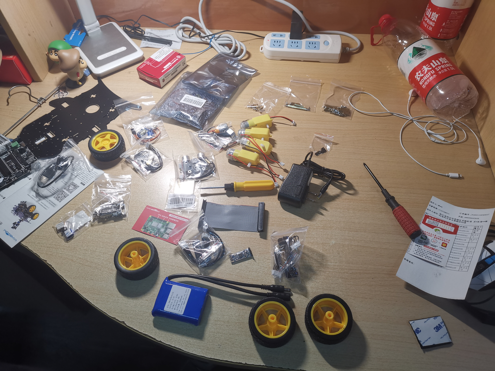
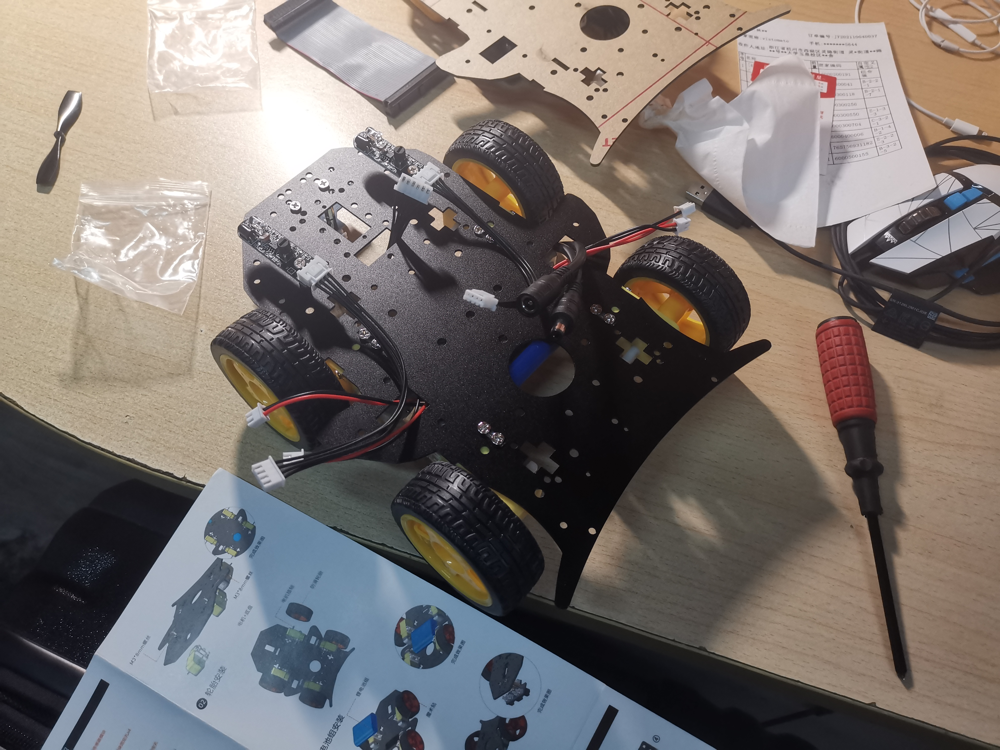
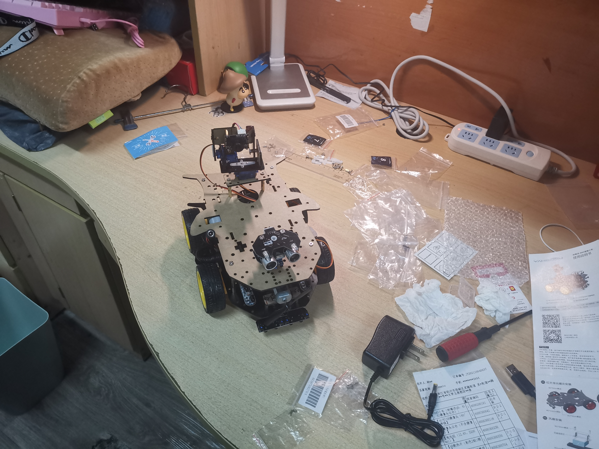

    

         
        
    

         
    

        
	

            
    Intellectual Acquisiton and 3D Reconstruction  Base on Smart Car
    
Course Project

     
     
    <table style="border:none;text-align:center;width:72%;font-family:仿宋;font-size:14px; margin: 0 auto;">
    <tbody style="font-family:方正公文仿宋;font-size:12pt;">
    	<tr style="font-weight:normal;"> 
    		<td style="width:20%;text-align:right;">题　　目</td>
    		<td style="width:2%">：</td> 
            <td style="width:40%;font-weight:normal;border-bottom: 1px solid;text-align:center;font-family:华文仿宋">Intellectual Acquisition and 3D Reconstruction Base on Smart Car</td>     </tr>
    	<tr style="font-weight:normal;"> 
    		<td style="width:20%;text-align:right;">上课时间</td>
    		<td style="width:2%">：</td> 
    		<td style="width:40%;font-weight:normal;border-bottom: 1px solid;text-align:center;font-family:华文仿宋">周三上午345节</td>     </tr>
    	<tr style="font-weight:normal;"> 
    		<td style="width:20%;text-align:right;">授课教师</td>
    		<td style="width:2%">：</td> 
    		<td style="width:40%;font-weight:normal;border-bottom: 1px solid;text-align:center;font-family:华文仿宋">吴鸿智</td>     </tr>
    	<tr style="font-weight:normal;"> 
    		<td style="width:20%;text-align:right;">姓　　名</td>
    		<td style="width:2%">：</td> 
    		<td style="width:40%;font-weight:normal;border-bottom: 1px solid;text-align:center;font-family:华文仿宋">林政楷、谢涛、陈蔚</td>     </tr>
    	<tr style="font-weight:normal;"> 
    		<td style="width:20%;text-align:right;">学　　号</td>
    		<td style="width:2%">：</td> 
    		<td style="width:40%;font-weight:normal;border-bottom: 1px solid;text-align:center;font-family:华文仿宋">3190104811、0000000000、3190100925</td>     </tr>
    	<tr style="font-weight:normal;"> 
    		<td style="width:20%;text-align:right;">组　　别</td>
    		<td style="width:%">：</td> 
    		<td style="width:40%;font-weight:normal;border-bottom: 1px solid;text-align:center;font-family:华文仿宋">Group 3</td>     </tr>
    	<tr style="font-weight:normal;"> 
    		<td style="width:20%;text-align:right;">日　　期</td>
    		<td style="width:2%">：</td> 
    		<td style="width:40%;font-weight:normal;border-bottom: 1px solid;text-align:center;font-family:华文仿宋">2021年11月6日</td>     </tr>
    </tbody>              
    </table>

# Intellectual Acquisition and 3D Reconstruction Base on Smart Car

<b>Abstract:</b>
 

With the development of camera system and computer vision, tons of methods to reconstruct the 3D shape of some object based on the given photos have merged. This article has come up with as well as realise a smart-car-based system to automatically take pictures and get the reconstruction result.

<b>Key Words:</b>
 

Automatic System; Smart Car Control; 

## Introduction

Recently years have viewed a enormous surge of the 3D reconstruction tools. Through using computer vision tools like `COLMAP` and so on, users are blessed with the ability to reconstruct the 3D shape of the object from even some photos took by their own phones.

However, such reconstruction may suffer from low accuracy and high error rate because the photos taken are not so accurate themselves and the parameters of the camera is hard to know. 

On the contrary, this article introduce a method of using the smart car to automatically acquire high quality photos from various perspective and finally achieve relatively good reconstruction results.

## Related Works

## Experiment Principles

### Smart Car Control

### Object Recognition and Tracking

### Path Determination

### High Speed Photo Acquisition

### 3D Reconstruction

## Equipment and Device

### Parameters about the Smart Car

The parameters of the components used in this project is listed below:

- Raspberry 4B
  - 4G Memory
- LM25965 circuit to provide power
- TB6612FNG circuit to drive the motor
- SG90 motor to drive the camera
- 480*600 USB camera 

### Experiment Steps

The project has follows the steps described below.

1. Buy the components of the smart car
2. Assemble them
2. Install operating system for the Raspberry
3. Try to control the motion of car
4. Complete color detection and auto-tracking part
5. Take pictures and do 3D reconstruction

## Experiment Result

### The Smart Car

The smart car is assembled from the parts bought from the website.

### Photos Acquired

Using the methods described in Chapter 3, a series of photos could be grabbed by the smart-car-camera system.

The photos would be from all perspective, here are two examples.

### Reconstruction Results

## Further Works

## References

 

